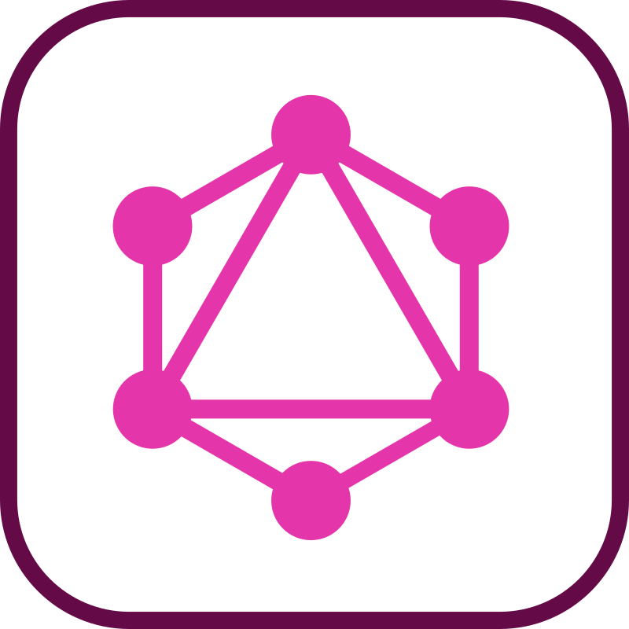
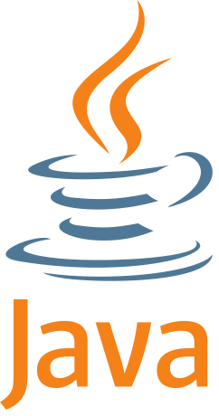
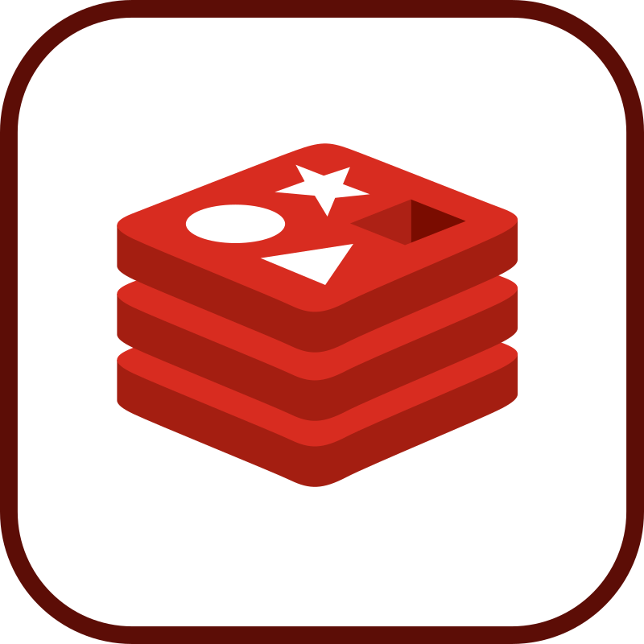
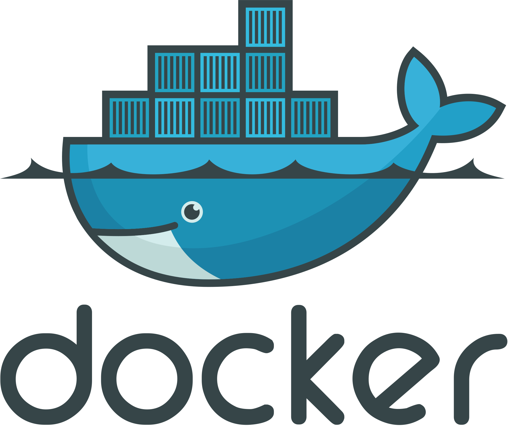

# 📚 Manual de Referencia Técnica

**Descripción corta:** Apuntes de desarrollador y guías rápidas de referencia. Notas de conceptos, comandos y sintaxis de multiples tecnologías.

Este repositorio actúa como mi **Base de Conocimiento Personal** y **Manual de Consulta Rápida** sobre diversas tecnologías clave en el desarrollo de software. Aquí se consolidan conceptos, sintaxis, comandos, configuraciones y ejemplos prácticos.

---

## 🚀 1. Índice Principal de Guías

Para una referencia rápida, haz clic en la tecnología o herramienta deseada. Recuerda que los logos están almacenados localmente en la carpeta `assets/`.

| Tecnología | Logo | Guía Principal | Estado | Categoría |
| :--- | :---: | :--- | :---: | :--- |
| **Jetpack Compose** |  | [Principios y Componibles Esenciales](./frontend/Jetpack-Compose.md) | Completado | Frontend |
| **GraphQL** |  | [Comandos Esenciales y Tipos de Datos](./framework/GraphQL.md) | Completado | Framework |
| **Kotlin (Básico)** |  | [Sintaxis y Conceptos Fundamentales](./backend/kotlin/01-Fundamentos_Sintaxis.md) | Completado | Backend |
| **Kotlin (Intermedio)** |  | [Funciones de Orden Superior y POO](./backend/kotlin/02-Colecciones_POO.md) | Completado | Backend |
| **Kotlin (Avanzado)** |  | [Coroutines y DSLs](./backend/kotlin/03-Funcional_Concurrencia.md) | Completado | Backend |
| **Java (Básico)** |  | [Sintaxis y Conceptos Fundamentales](./backend/java/01-Fundametos_Sintaxis.md) | Completado | Backend |
| **Java (Intermedio)** |  | [Programación Orientada a Objetos y Colecciones](./backend/java/02-Colecciones_POO.md) | Completado | Backend |
| **Java (Avanzado)** |  | [Multithreading y API Streams](./backend/java/03-Funcional_Concurrencias_Moderno.md) | Completado | Backend |
| **Redis** |  | [Comandos Esenciales y Tipos de Datos](./base-de-datos/Redis.md) | Completado | Bases de Datos |
| **JUnit** |  | [Guía Rápida de Pruebas Unitarias](./testing/JUnit.md) | Completado | Testing |
| **Mockito** |  | [Guía Rápida de Framework Mock para pruebas Unitarias](./testing/Mockito.md) | Completado | Testing |
| **Git** |  | [Comandos Esenciales y Flujos de Trabajo](./herramientas/Git.md) | Completado | Herramientas |
| **Maven** |  | [Comandos Esenciales y Flujos de Trabajo](./herramientas/Maven.md) | Completado | Herramientas |
| **Jenkins** |  | [Comandos Esenciales y Flujos de Trabajo](./herramientas/Jenkins.md) | Completado | Herramientas |
| **Docker** |  | [Comandos Esenciales y Flujos de Trabajo](./herramientas/Docker.md) | Completado | Herramientas |
| **Linux** |  | [Comandos Esenciales y funcionamiento del entrorno](./so/Linux.md) | Parcial | SO |
---

## 📂 2. Estructura Detallada del Repositorio

### Frontend (`/frontend`)
Apuntes sobre tecnologías para la construcción de interfaces de usuario.
* Jetpack Compose

### Frameworks (`/framework`)
Guías sobre sistemas de gestión de framework.
* GraphQL

### Backend(`/backend`)
Apuntes de sintaxis, conceptos y patrones específicos de lenguajes.
* Kotlin (Básico, Intermedio, Avanzado)
* Java (Básico, Intermedio, Avanzado)

### Bases de Datos (`/base-de-datos`)
Guías sobre sistemas de gestión de bases de datos relacionales y NoSQL.
* Redis

### Testing (`/testing`)
Herramientas y metodologías de prueba.
* JUnit
* Mockito

### Herramientas y DevOps (`/herramientas`)
Herramientas auxiliares y flujos de trabajo de desarrollo.
* Git
* Maven
* Jenkins
* Docker

### Sistema operativo (`/so`)
Sistemas operativos para el desarrollo y mantenimiento.
* Linux

---

## ⚙️ 3. Inicio y Contribución (Uso Personal)
Para usar este manual localmente en tu máquina:
1.  **Clonar el Repositorio:**
    ```bash
    git clone [https://github.com/tu-usuario/manual-referencia-tecnica.git](https://github.com/tu-usuario/manual-referencia-tecnica.git)
    ```
2.  **Actualizar:** Para obtener los últimos apuntes.
    ```bash
    git pull origin main
    ```
---

## 🔒 4. Licencia
**Este repositorio no tiene una licencia explícita.**
Esto significa que, por defecto, **todos los derechos de autor están reservados** por el creador.
* No se permite copiar, modificar o distribuir el contenido sin permiso expreso del autor.
---
