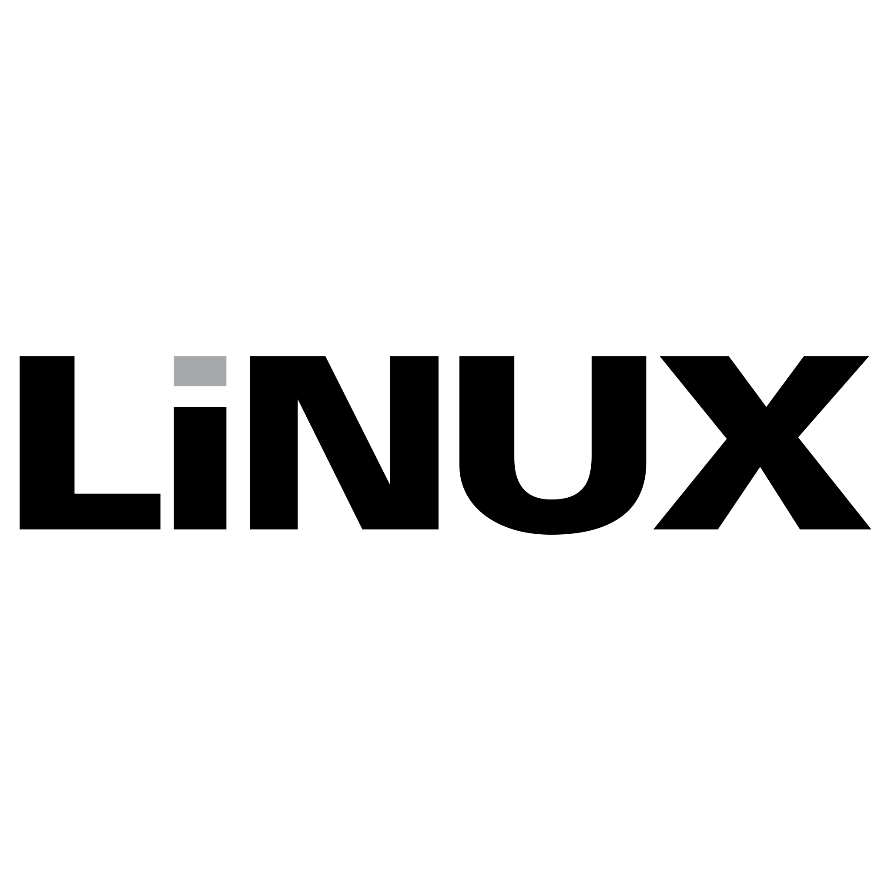
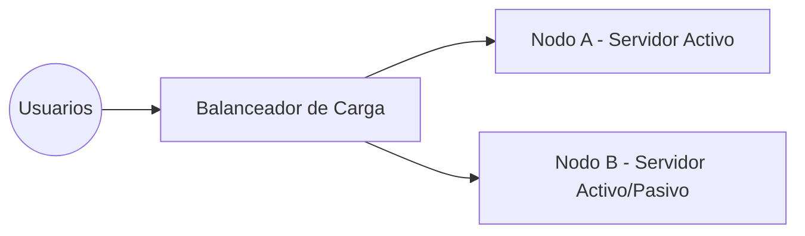

  

## Índice
- [Conceptos Fundamentales de Seguridad (Tema 1)](#conceptos-fundamentales-de-seguridad-tema-1)
  - [La Tríada CIA y el No Repudio](#la-tríada-cia-y-el-no-repudio)
  - [Marco de Ciberseguridad (NIST)](#marco-de-ciberseguridad-nist)
  - [Gestión de Identidad y Acceso (IAM)](#gestión-de-identidad-y-acceso-iam)
  - [Controles de Seguridad](#controles-de-seguridad)
    - [Clasificación por Implementación](#clasificación-por-implementación)
    - [Tipos Funcionales (Cuándo actúan)](#tipos-funcionales-cuándo-actúan)
  - [Análisis de Deficiencias (Gap Analysis)](#análisis-de-deficiencias-gap-analysis)
  - [Funciones y Responsabilidades](#funciones-y-responsabilidades)
  - [Unidades de Negocio de Seguridad](#unidades-de-negocio-de-seguridad)
    - [SOC (Security Operations Center)](#soc-security-operations-center)
    - [Desarrollo y Operaciones (DevSecOps)](#desarrollo-y-operaciones-devsecops)
    - [Respuesta a Incidentes (CIRT / CSIRT / CERT)](#respuesta-a-incidentes-cirt--csirt--cert)
- [Tipos de Amenazas (Tema 2)](#tipos-de-amenazas-tema-2)
  - [Conceptos Clave: Vulnerabilidad, Amenaza y Riesgo](#conceptos-clave-vulnerabilidad-amenaza-y-riesgo)
  - [Atributos de los Actores de Amenazas](#atributos-de-los-actores-de-amenazas)
  - [Perfiles de Atacantes](#perfiles-de-atacantes)
    - [Hackers y Hacktivistas](#hackers-y-hacktivistas)
    - [Amenazas Avanzadas (Estados Nación y Crimen Organizado)](#amenazas-avanzadas-estados-nación-y-crimen-organizado)
    - [Amenazas Internas (Insiders)](#amenazas-internas-insiders)
  - [Superficie de Ataque](#superficie-de-ataque)
  - [Vectores Tecnológicos](#vectores-tecnológicos)
    - [Software Vulnerable](#software-vulnerable)
    - [Vectores de Red](#vectores-de-red)
    - [Vectores basados en Señuelos (Baiting)](#vectores-basados-en-señuelos-baiting)
    - [Vectores basados en Mensajes](#vectores-basados-en-mensajes)
  - [El Factor Humano: Ingeniería Social](#el-factor-humano-ingeniería-social)
    - [Suplantación y Pretexting](#suplantación-y-pretexting)
    - [Phishing y Pharming](#phishing-y-pharming)
  - [Cadena de Suministro (Supply Chain)](#cadena-de-suministro-supply-chain)
  - [Compromiso de Correo Electrónico Empresarial (BEC)](#compromiso-de-correo-electrónico-empresarial-bec)
  - [Typosquatting (Allanamiento de error tipográfico)](#typosquatting-allanamiento-de-error-tipográfico)
  - [Desinformación y Malinformación](#desinformación-y-malinformación)
  - [Watering Hole Attack (Ataque de abrevadero)](#watering-hole-attack-ataque-de-abrevadero)
- [Algoritmos Criptográficos (Tema 3)](#algoritmos-criptográficos-tema-3)
  - [Cifrado Simétrico (Symmetric Encryption)](#cifrado-simétrico-symmetric-encryption)
  - [Cifrado Asimétrico (Asymmetric Encryption)](#cifrado-asimétrico-asymmetric-encryption)
  - [Hashing](#hashing)
  - [Firmas Digitales](#firmas-digitales)
  - [Longitud de la Clave](#longitud-de-la-clave)
  - [Infraestructura de Clave Pública (PKI)](#infraestructura-de-clave-pública-pki)
  - [Autoridades Certificadoras (CA)](#autoridades-certificadoras-ca)
  - [Certificados Digitales](#certificados-digitales)
  - [El Proceso de Registro (CSR)](#el-proceso-de-registro-csr)
  - [Ciclo de Vida y Revocación](#ciclo-de-vida-y-revocación)
  - [Almacenamiento Seguro](#almacenamiento-seguro)
  - [Soluciones Criptográficas](#soluciones-criptográficas)
  - [Cifrado de Almacenamiento (Confidencialidad)](#cifrado-de-almacenamiento-confidencialidad)
  - [Cifrado de Bases de Datos](#cifrado-de-bases-de-datos)
  - [Intercambio de Claves y Secreto de Reenvío Perfecto (PFS)](#intercambio-de-claves-y-secreto-de-reenvío-perfecto-pfs)
  - [Protección de Contraseñas (Salting y Stretching)](#protección-de-contraseñas-salting-y-stretching)
  - [Tecnologías Emergentes y Ofuscación](#tecnologías-emergentes-y-ofuscación)
- [Implementación de la gestión de identidades y accesos (Tema 4)](#implementación-de-la-gestión-de-identidades-y-accesos-tema-4)
  - [Autenticación](#autenticación)
    - [Gestión de Contraseñas](#gestión-de-contraseñas)
    - [Autenticación de Multifactores (MFA)](#autenticación-de-multifactores-mfa)
    - [Autenticación Biométrica](#autenticación-biométrica)
    - [Tokens de Autenticación](#tokens-de-autenticación)
    - [Autenticación sin Contraseña (Passwordless)](#autenticación-sin-contraseña-passwordless)
  - [Autorizacion](#autorizacion)
    - [Modelos de Control de Acceso](#modelos-de-control-de-acceso)
    - [Principio de Mínimo Privicio](#principio-de-mínimo-privicio)
    - [Ciclo de Vida de la Cuenta (Aprovisionamiento)](#ciclo-de-vida-de-la-cuenta-aprovisionamiento)
    - [Políticas y Restricciones de Acceso](#políticas-y-restricciones-de-acceso)
    - [Administración de Acceso con Privilegios (PAM)](#administración-de-acceso-con-privilegios-pam)
  - [Administración](#administración)
    - [Windows](#windows)
    - [Linux](#linux)
    - [Servicios de Directorio (LDAP)](#servicios-de-directorio-ldap)
    - [Inicio de Sesión Único (SSO) con Kerberos](#inicio-de-sesión-único-sso-con-kerberos)
    - [Federación de Identidades](#federación-de-identidades)
    - [Protocolos de Federación y API](#protocolos-de-federación-y-api)
- [Arquitectura de Red Empresarial (Tema 5)](#arquitectura-de-red-empresarial-tema-5)
  - [Modelado de Red (Modelo OSI)](#modelado-de-red-modelo-osi)
  - [Infraestructura de Conmutación (Capa 2)](#infraestructura-de-conmutación-capa-2)
  - [Infraestructura de Enrutamiento y Segmentación (Capa 3)](#infraestructura-de-enrutamiento-y-segmentación-capa-3)
  - [Análisis de la Superficie de Ataque](#análisis-de-la-superficie-de-ataque)
  - [Aislamiento Físico (Air-Gap)](#aislamiento-físico-air-gap)
  - [Consideraciones Arquitectónicas Modernas](#consideraciones-arquitectónicas-modernas)
  - [Ubicación del Dispositivo y Defensa en Profundidad](#ubicación-del-dispositivo-y-defensa-en-profundidad)
  - [Atributos de los Dispositivos](#atributos-de-los-dispositivos)
  - [Cortafuegos (Firewalls)](#cortafuegos-firewalls)
  - [Servidores Proxy](#servidores-proxy)
  - [Sistemas de Detección y Prevención (IDS/IPS)](#sistemas-de-detección-y-prevención-idsips)
  - [Tecnologías Avanzadas](#tecnologías-avanzadas)
  - [Balanceadores de Carga](#balanceadores-de-carga)
  - [Arquitectura de Acceso Remoto](#arquitectura-de-acceso-remoto)
  - [VPN de Capa de Transporte (TLS)](#vpn-de-capa-de-transporte-tls)
  - [VPN de Capa de Red (IPsec)](#vpn-de-capa-de-red-ipsec)
  - [Acceso a Escritorio Remoto](#acceso-a-escritorio-remoto)
  - [Shell Seguro (SSH)](#shell-seguro-ssh)
  - [Gestión Fuera de Banda (OOB) y Servidores de Salto](#gestión-fuera-de-banda-oob-y-servidores-de-salto)
- [Infraestructura en la Nube (Tema 6)](#infraestructura-en-la-nube-tema-6)
  - [Modelos de Despliegue en la Nube](#modelos-de-despliegue-en-la-nube)
  - [Modelos de Servicio en la Nube (XaaS)](#modelos-de-servicio-en-la-nube-xaas)
  - [Matriz de Responsabilidades](#matriz-de-responsabilidades)
  - [Computación Centralizada vs. Descentralizada](#computación-centralizada-vs-descentralizada)
    - [Computación Centralizada](#computación-centralizada)
    - [Computación Descentralizada](#computación-descentralizada)
  - [Arquitectura Resiliente y Replicación](#arquitectura-resiliente-y-replicación)
  - [Virtualización de Aplicaciones y Contenedores](#virtualización-de-aplicaciones-y-contenedores)
  - [Arquitecturas Modernas y Automatización](#arquitecturas-modernas-y-automatización)
    - [Computación Sin Servidor (Serverless / FaaS)](#computación-sin-servidor-serverless--faas)
    - [Infraestructura como Código (IaC)](#infraestructura-como-código-iac)
    - [Escalado Automático (Autoscaling)](#escalado-automático-autoscaling)
  - [Redes Definidas por Software (SDN)](#redes-definidas-por-software-sdn)
    - [Los Tres Planos de la Red (Crucial para Examen)](#los-tres-planos-de-la-red-crucial-para-examen)
    - [APIs de Comunicación](#apis-de-comunicación)
    - [Virtualización de Funciones de Red (NFV)](#virtualización-de-funciones-de-red-nfv)
  - [Sistemas Integrados (Embedded Systems)](#sistemas-integrados-embedded-systems)
    - [Sistemas Operativos en Tiempo Real (RTOS)](#sistemas-operativos-en-tiempo-real-rtos)
  - [Sistemas de Control Industrial (ICS) y SCADA](#sistemas-de-control-industrial-ics-y-scada)
    - [Arquitectura de Componentes de un ICS](#arquitectura-de-componentes-de-un-ics)
    - [La Tríada AIC (Inversión de CIA)](#la-tríada-aic-inversión-de-cia)
  - [Internet de las Cosas (IoT)](#internet-de-las-cosas-iot)
  - [Desperimetrización y Confianza Cero (Zero Trust)](#desperimetrización-y-confianza-cero-zero-trust)
    - [Desperimetrización](#desperimetrización)
    - [Arquitectura de Confianza Cero (ZTA - Zero Trust Architecture)](#arquitectura-de-confianza-cero-zta---zero-trust-architecture)
    - [Componentes de Seguridad Esenciales en una ZTA](#componentes-de-seguridad-esenciales-en-una-zta)
  - [Tecnologías de Seguridad Avanzadas en la Nube y Redes](#tecnologías-de-seguridad-avanzadas-en-la-nube-y-redes)
    - [SASE (Secure Access Service Edge)](#sase-secure-access-service-edge)
    - [SD-WAN (Software-Defined WAN)](#sd-wan-software-defined-wan)
- [Gestión de Activos y Estrategias de Redundancia (Tema 7)](#gestión-de-activos-y-estrategias-de-redundancia-tema-7)
  - [Gestión de Activos](#gestión-de-activos)
    - [Seguimiento de Activos (Asset Tracking)](#seguimiento-de-activos-asset-tracking)
  - [Copias de Seguridad de Datos (Backup Strategies)](#copias-de-seguridad-de-datos-backup-strategies)
    - [Tipos de Copias de Seguridad (Esencial para Examen)](#tipos-de-copias-de-seguridad-esencial-para-examen)
    - [Regla del 3-2-1 para Backups](#regla-del-3-2-1-para-backups)
  - [Protección Avanzada de Datos](#protección-avanzada-de-datos)
    - [Prevención de Pérdida de Datos (DLP - Data Loss Prevention)](#prevención-de-pérdida-de-datos-dlp---data-loss-prevention)
    - [Cifrado de Datos y Gestión de Claves](#cifrado-de-datos-y-gestión-de-claves)
  - [Destrucción Segura de Datos (Data Sanitization)](#destrucción-segura-de-datos-data-sanitization)
  - [Estrategias de Redundancia](#estrategias-de-redundancia)
    - [Continuidad de las Operaciones (COOP)](#continuidad-de-las-operaciones-coop)
  - [Alta Disponibilidad (High Availability - HA) y Redundancia de Sistemas](#alta-disponibilidad-high-availability---ha-y-redundancia-de-sistemas)
    - [Tolerancia a Fallos en Almacenamiento (RAID)](#tolerancia-a-fallos-en-almacenamiento-raid)
  - [Agrupamiento o Clustering](#agrupamiento-o-clustering)
  - [Redundancia de Energía](#redundancia-de-energía)
    - [Componentes Clave de Redundancia:](#componentes-clave-de-redundancia)
  - [Diversidad de Plataformas y Defensa en Profundidad](#diversidad-de-plataformas-y-defensa-en-profundidad)
    - [Diversidad de Plataformas:](#diversidad-de-plataformas)
    - [Defensa en Profundidad:](#defensa-en-profundidad)
  - [Tecnologías de Engaño y Disrupción](#tecnologías-de-engaño-y-disrupción)
    - [Herramientas de Engaño:](#herramientas-de-engaño)
    - [Estrategias de Disrupción (Ofuscación):](#estrategias-de-disrupción-ofuscación)
  - [Pruebas de Resiliencia](#pruebas-de-resiliencia)
    - [Métodos de Prueba](#métodos-de-prueba)
    - [Documentación y Terceros](#documentación-y-terceros)
  - [Fundamentos de Seguridad Física](#fundamentos-de-seguridad-física)
    - [Fundamentos de Control de Acceso Físico](#fundamentos-de-control-de-acceso-físico)
  - [Diseño Ambiental, Rejas e Iluminación](#diseño-ambiental-rejas-e-iluminación)
    - [CPTED (Seguridad Física a través del Diseño Ambiental)](#cpted-seguridad-física-a-través-del-diseño-ambiental)
    - [Elementos de Diseño de Seguridad](#elementos-de-diseño-de-seguridad)
  - [Puertas, Cerraduras y Controles de Entrada](#puertas-cerraduras-y-controles-de-entrada)
    - [Tipos de Cerraduras:](#tipos-de-cerraduras)
    - [Dispositivos de Control de Acceso de Alta Seguridad:](#dispositivos-de-control-de-acceso-de-alta-seguridad)
  - [Vigilancia y Guardias de Seguridad](#vigilancia-y-guardias-de-seguridad)
    - [Guardias de Seguridad Humanos](#guardias-de-seguridad-humanos)
    - [Videovigilancia (CCTV)](#videovigilancia-cctv)
  - [Sistemas de Alarmas y Sensores](#sistemas-de-alarmas-y-sensores)
    - [Tipos de Alarmas](#tipos-de-alarmas)
    - [Tipos de Sensores de Movimiento](#tipos-de-sensores-de-movimiento)
- [Vulnerabilidades de Dispositivos, Sistemas Operativos, Aplicaciones y Nube (Tema 8)](#vulnerabilidades-de-dispositivos-sistemas-operativos-aplicaciones-y-nube-tema-8)
  - [Vulnerabilidades del Sistema Operativo](#vulnerabilidades-del-sistema-operativo)
    - [Características y Vectores por Plataforma](#características-y-vectores-por-plataforma)
  - [Tipos de Vulnerabilidad y Explotación](#tipos-de-vulnerabilidad-y-explotación)
    - [Sistemas Heredados (*Legacy*) y de Fin de Vida (*EOL - End of Life*):](#sistemas-heredados-legacy-y-de-fin-de-vida-eol---end-of-life)
    - [Vulnerabilidades en Virtualización y Nube](#vulnerabilidades-en-virtualización-y-nube)
  - [Vulnerabilidades de Día Cero (*Zero-Day*) (8.1.3)](#vulnerabilidades-de-día-cero-zero-day-813)
  - [Vulnerabilidades de Configuración Errónea](#vulnerabilidades-de-configuración-errónea)
  - [Vulnerabilidades Criptográficas](#vulnerabilidades-criptográficas)
    - [Principales Debilidades](#principales-debilidades)
  - [Sideloading, Rooting y Jailbreaking](#sideloading-rooting-y-jailbreaking)
  - [Vulnerabilidades de Aplicación](#vulnerabilidades-de-aplicación)
    - [Condición de Carrera (*Race Condition*) y TOCTOU](#condición-de-carrera-race-condition-y-toctou)
    - [Vulnerabilidades de la Cadena de Suministro (*Supply Chain Attacks*)](#vulnerabilidades-de-la-cadena-de-suministro-supply-chain-attacks)
  - [8. Alcance de la Evaluación (*Assessment Scope*)](#8-alcance-de-la-evaluación-assessment-scope)
    - [Perspectiva del Pentester (Auditor de Seguridad)](#perspectiva-del-pentester-auditor-de-seguridad)
    - [Perspectiva del Atacante (Actor de Amenazas)](#perspectiva-del-atacante-actor-de-amenazas)
  - [Ataques a las Aplicaciones Web](#ataques-a-las-aplicaciones-web)
    - [Conceptos Clave y Vectores](#conceptos-clave-y-vectores)
  - [Ataques a Aplicaciones Basadas en la Nube](#ataques-a-aplicaciones-basadas-en-la-nube)
    - [Desafíos de Seguridad en la Nube](#desafíos-de-seguridad-en-la-nube)
    - [Solución Tecnológica: CASB (Cloud Access Security Broker)](#solución-tecnológica-casb-cloud-access-security-broker)
      - [Modos de Implementación de un CASB](#modos-de-implementación-de-un-casb)
  - [Vulnerabilidades en la Cadena de Suministro](#vulnerabilidades-en-la-cadena-de-suministro)
    - [Vectores de Compromiso](#vectores-de-compromiso)
    - [Herramientas de Mitigación y Gestión](#herramientas-de-mitigación-y-gestión)
  - [Métodos e Identificación de Vulnerabilidades](#métodos-e-identificación-de-vulnerabilidades)
    - [Feeds de Amenazas (*Threat Feeds*)](#feeds-de-amenazas-threat-feeds)
    - [Escaneo de Vulnerabilidades](#escaneo-de-vulnerabilidades)
    - [Análisis e Identificación Avanzada](#análisis-e-identificación-avanzada)
  

# Conceptos Fundamentales de Seguridad (Tema 1)

La seguridad de la información (Infosec) es la protección de los datos contra accesos no autorizados, ataques o daños. Se basa en un proceso continuo de evaluación, configuración y supervisión de sistemas.

El objetivo principal es garantizar que la información de una organización esté protegida frente a amenazas internas y externas.

## La Tríada CIA y el No Repudio

Para que un sistema sea seguro, debe cumplir con tres propiedades fundamentales conocidas como Tríada CIA:

- Confidencialidad: Solo personas autorizadas pueden leer la información.
  - Ejemplo: Cifrar un correo electrónico para que solo el destinatario pueda leerlo.
- Integridad: Los datos no se modifican sin autorización durante su almacenamiento o transferencia.
  - Ejemplo: Un sistema de firmas digitales que detecta si un contrato fue alterado.
- Disponibilidad: La información está accesible cuando las personas autorizadas la necesitan.
  - Ejemplo: Mantener servidores con respaldo eléctrico para que la web no se caiga.
- No Repudio: Garantiza que una persona no pueda negar haber realizado una acción (crear o enviar algo).Normalmente se consigue mediante:
  - Firmas digitales
  - Certificados digitales
  - Registros de auditoría (logs)
- Ejemplo: Un registro de auditoría que confirma quién firmó un documento legal.

## Marco de Ciberseguridad (NIST)

El National Institute of Standards and Technology (NIST) desarrolló un marco de ciberseguridad muy utilizado para organizar las funciones de seguridad.

Este marco divide las tareas en cinco funciones principales:

- Identificar: Desarrollar políticas y evaluar riesgos y activos.
  - Ejemplos:
    - Inventario de activos
    - Evaluación de riesgos
    - Definición de políticas de seguridad
- Proteger: Instalar y operar activos de TI con seguridad integrada.
  - Ejemplos:
    - Control de acceso
    - Cifrado de datos
    - Formación de empleados
- Detectar: Monitoreo continuo para hallar amenazas.
  - Ejemplos:
    - Sistemas de monitoreo
    - Análisis de registros
    - Alertas de seguridad
- Responder: Analizar y erradicar amenazas detectadas.
  - Ejemplos:
    - Contener un ataque
    - Investigar la causa
    - Comunicar el incidente
- Recuperar: Restaurar sistemas y datos tras un ataque.
  - Ejemplos:
    - Restauración desde copias de seguridad
    - Recuperación de servicios
    - Mejora de controles tras el incidente

## Gestión de Identidad y Acceso (IAM)

La Gestión de Identidad y Acceso (IAM) controla cómo los usuarios interactúan con los recursos de un sistema.

En este modelo existen dos elementos:
- Sujetos (Subjects): usuarios o dispositivos
- Objetos (Objects): recursos como archivos, bases de datos o servidores

El proceso de acceso se divide en cuatro pasos:
- Identificación: Crear una cuenta única (ID) para el usuario.
  - Ejemplo: Introducir un nombre de usuario
- Autenticación: Probar que eres quien dices ser (ej. mediante una contraseña o certificado)
  - Ejemplo:
    - Contraseña
    - Token
    - Certificado digital
    - Huella biométrica
- Autorización: Determinar qué permisos tienes sobre un recurso (ej. solo lectura o control total).
  - Ejemplo:
    - Solo lectura
    - Escritura
    - Control total
- Registro (Accounting): Rastrear las acciones realizadas por el sujeto en los registros de auditoría.
  - Sirve para:
    - Auditorías
    - Investigaciones de incidentes
    - Cumplimiento normativo
  - Este modelo también se conoce como AAA:
    - Authentication
    - Authorization
    - Accounting

## Controles de Seguridad

Los controles son herramientas o procedimientos para proteger la confidencialidad, integridad y disponibilidad.

### Clasificación por Implementación

- Gerencial: Supervisión y selección de controles (ej. evaluación de riesgos).
  - Evaluaciones de riesgo
  - Políticas de seguridad
  - Auditorías
- Operacional: Ejecutado por personas (ej. guardias de seguridad o capacitación).
  - Guardias de seguridad
  - Procedimientos de respuesta a incidentes
  - Formación de empleados
  - Control físico de instalaciones
- Técnico: Sistemas de hardware/software (ej. firewalls, antivirus).
  - Firewalls
  - Antivirus
  - Sistemas IDS/IPS
  - Cifrado
- Físico: Protección de instalaciones (ej. cerraduras, cámaras, alarmas).

### Tipos Funcionales (Cuándo actúan)

Los controles también se clasifican según cuándo actúan frente a una amenaza.

- Preventivo: Actúa antes del ataque para bloquearlo (ej. listas de acceso, parches).
  - Listas de control de acceso
  - Parcheo de sistemas
  - Autenticación multifactor
- De Detección: Actúa durante el ataque para identificarlo (ej. registros/logs).
  - Sistemas de monitoreo
  - Registros de actividad
  - IDS
- Correctivo: Actúa después del ataque para reducir el impacto (ej. copias de seguridad/backups).
  - Restaurar un sistema tras una intrusión
- Recovery: Permite restaurar operaciones normales después de un ataque.
  - Restaurar sistemas desde copias de seguridad tras un ransomware.
- Otros:
  - Directivo: Reglas de comportamiento (ej. políticas, contratos).
    - Políticas de seguridad
    - Normas de uso aceptable
  - Disuasivo: Desalienta psicológicamente al atacante (ej. avisos de multas).
    - Avisos legales
    - Cámaras visibles
    - Carteles de monitoreo
  - Compensatorio: Sustituto si el control principal no es posible (ej. aislar un sistema viejo que no admite parches).
    - Aislar un sistema antiguo que no puede recibir parches de seguridad.

## Análisis de Deficiencias (Gap Analysis)

El Gap Analysis es el proceso de comparar el estado actual de seguridad de una organización con el estado ideal definido por un estándar o marco de referencia.

- Ejemplo: Comparar los controles actuales de una empresa con el marco del National Institute of Standards and Technology.

- Objetivo
  - Identificar controles faltantes
  - Detectar configuraciones incorrectas
  - Priorizar inversiones en seguridad

## Funciones y Responsabilidades

La seguridad dentro de una organización requiere que diferentes roles tengan responsabilidades definidas.

- Política de Seguridad: Documento formal que define cómo se protegerán los recursos.
- Responsabilidades Típicas:
  - Directores/Propietarios: Responsabilidad general y legal.
  - Personal Técnico (ej. ISSO): Implementar, mantener y monitorear la política.
  - Personal No Técnico: Cumplir con las políticas y la ley.

## Unidades de Negocio de Seguridad

Para que la seguridad funcione en una organización grande, se suelen crear equipos o centros especializados

### SOC (Security Operations Center)

Es el "cuartel general" donde los profesionales supervisan y protegen los activos de la empresa (finanzas, ventas, etc.) las 24 horas.

- Función: Proporcionar personal y recursos para detectar y responder rápido a incidentes.
- Ejemplo: Un equipo de analistas que recibe una alerta de que alguien está intentando entrar al servidor desde otro país a las 3 a.m. y bloquea el acceso de inmediato.

### Desarrollo y Operaciones (DevSecOps)

Este concepto se basa en "moverse a la izquierda" (shift left). Significa que la seguridad no se añade al final de un proyecto, sino que se integra desde la planificación y el diseño.

- Concepto clave: Las operaciones de seguridad se tratan como desarrollo de software, usando automatización mediante código para mejorar la detección.
- Ejemplo: Al programar una aplicación bancaria, el equipo de seguridad revisa el código cada vez que el programador sube un cambio, en lugar de esperar a que la app esté terminada para buscar errores.

### Respuesta a Incidentes (CIRT / CSIRT / CERT)

Los equipos de respuesta a incidentes actúan como punto central cuando ocurre un incidente de seguridad.

- Siglas comunes:
  - CIRT – Computer Incident Response Team
  - CSIRT – Computer Security Incident Response Team
  - CERT – Computer Emergency Response Team
- Funciones principales:
  - Identificar incidentes
  - Contener ataques
  - Erradicar amenazas
  - Recuperar sistemas

A veces trabajan dentro del SOC o como equipo independiente.

- Ejemplo: Si una empresa sufre un ataque de ransomware, el CSIRT decide:
  - aislar los sistemas
  - analizar el malware
  - restaurar los datos desde backups.

# Tipos de Amenazas (Tema 2)

Para defender una red, primero hay que entender el riesgo. El riesgo no es algo abstracto, sino el resultado de una fórmula:

> Riesgo = Probabilidad × Impacto

Esto significa que un evento poco probable pero con gran impacto puede ser tan peligroso como uno muy probable con impacto moderado.

## Conceptos Clave: Vulnerabilidad, Amenaza y Riesgo

Antes de analizar ataques es importante entender cuatro conceptos básicos.

- Activo (Asset)
Un activo es cualquier recurso que tiene valor para una organización y debe protegerse.
- Ejemplos:
  - Datos de clientes
  - Servidores
  - Sistemas de pago
  - Propiedad intelectual
  - Infraestructura de red

- Vulnerabilidad: Es una debilidad en un sistema que puede ser explotada.
  - Puede existir en:
    - hardware
    - software
    - configuraciones
    - procesos
    - seguridad física
  - Ejemplo: 
    - Software sin actualizar
    - Contraseña débil
    - Puerto de red innecesariamente abierto
- Amenaza: Una amenaza es la posibilidad de que alguien o algo explote una vulnerabilidad. El camino o método utilizado para realizar el ataque se llama vector de ataque.
  - Ejemplo: Un atacante aprovecha una vulnerabilidad en un servidor web para ejecutar código malicioso.
- Riesgo: El riesgo es el nivel real de peligro para la organización. Se calcula evaluando:
  - la probabilidad de que ocurra el ataque
  - el impacto que tendría sobre los activos

## Atributos de los Actores de Amenazas

Para clasificar a un atacante, el examen de CompTIA analiza varios atributos.

- Ubicación: Indica si el atacante está dentro o fuera de la organización.
  - Interno: empleado o persona con acceso autorizado
  - Externo: atacante desde Internet
- Sofisticación / Capacidad: Nivel técnico del atacante.
  - Bajo: uso de herramientas automáticas
  - Alto: desarrollo de exploits propios
- Recursos / Financiamiento: Capacidad económica o tecnológica del atacante.
  - Individuos con recursos limitados
  - Grupos criminales organizados
  - Gobiernos o agencias estatales
- Motivación: Razón por la que el atacante realiza el ataque.
  - Ejemplos:
    - dinero
    - espionaje
    - ideología política
    - sabotaje
    - venganza personal

## Perfiles de Atacantes

### Hackers y Hacktivistas

- Hacker Autorizado (White Hat): Tiene permiso para buscar fallos (Pentesting).
- Hacker No Autorizado (Black Hat): Entra en sistemas sin permiso para fines maliciosos.
- Atacante sin formación (Script Kiddie): Alguien con poca habilidad que solo usa herramientas que otros hicieron.
- Hacktivista: Ataca para promover una agenda política o social (ej. robar datos para avergonzar a una empresa).

### Amenazas Avanzadas (Estados Nación y Crimen Organizado)

- Estado Nación: Atacantes financiados por gobiernos con grandes recursos técnicos. Sus objetivos suelen ser:
  - espionaje
  - sabotaje
  - desinformación
- APT (Amenaza Persistente Avanzada) Una APT es un ataque prolongado y dirigido donde el atacante intenta mantener acceso a la red durante largos periodos. Características principales:
  - ataques sigilosos
  - objetivos específicos
  - acceso persistente a sistemas comprometidos
- Crimen Organizado: Grupos criminales que buscan principalmente beneficio económico. Actividades comunes:
  - fraude
  - robo de datos
  - ransomware
  - extorsión
- Competidores: Empresas que intentan robar secretos comerciales o propiedad intelectual para obtener ventaja en el mercado.

### Amenazas Internas (Insiders)

Las amenazas internas provienen de personas que ya tienen acceso legítimo a la organización.

- Insiders malintencionados: Empleados que buscan beneficio personal o venganza.
  - Ejemplos:
    - robo de datos
    - sabotaje de sistemas
- Insiders no intencionales: Usuarios que causan problemas por error o descuido.
  - Ejemplos:
    - perder un USB con datos sensibles
    - enviar información confidencial al destinatario equivocado
- Shadow IT: Ocurre cuando empleados utilizan:
  - software
  - servicios en la nube
  - aplicaciones
  - sin aprobación del departamento de TI.
Esto crea nuevos riesgos de seguridad.

## Superficie de Ataque

La superficie de ataque es la suma total de todos los puntos donde un atacante puede intentar entrar o extraer datos de un sistema. Comprender los métodos de infiltración es esencial para implementar los controles adecuados.

Incluye:
- aplicaciones
- servicios de red
- dispositivos
- usuarios

- Vector de amenaza/ataque: Es la ruta específica o herramienta que usa el atacante.
  - email malicioso
  - puerto abierto
  - sitio web comprometido
  - ingeniería social
- Estrategia fundamental: Reducir la superficie de ataque limitando el acceso únicamente a:
  - servicios necesarios
  - puertos esenciales
  - usuarios autorizados

## Vectores Tecnológicos

### Software Vulnerable

Casi ningún software es perfecto. Las fallas en el código permiten eludir controles.
- Estrategia: 
  - Gestión de parches.
  - Actualizar software para corregir vulnerabilidades conocidas.
  - Si una aplicación no puede actualizarse, se puede aplicar un control compensatorio, como aislarla de la red.
- Escaneo de vulnerabilidades:
  - Escaneo con agentes
    - software instalado en cada sistema
    - permite análisis más detallado
  - Escaneo sin agentes
    - análisis remoto desde la red
    - no requiere instalar software en los equipos

### Vectores de Red

- Ataque Remoto: No requiere una sesión previa; el atacante envía código a través de la red.
- Ataque Local: Requiere que el atacante ya tenga una sesión iniciada o credenciales válidas.
  - una sesión activa
  - acceso físico
  - credenciales válidas
- Puntos débiles comunes:
  - puertos abiertos innecesarios
  - falta de cifrado en comunicaciones
  - contraseñas por defecto
  - servicios mal configurados

### Vectores basados en Señuelos (Baiting)

Se ofrece algo atractivo para que la víctima caiga en la trampa:

- Dispositivos extraíbles: Dejar un USB infectado en un parking (USB Drop) esperando que alguien lo conecte.
- Archivos maliciosos: Ocultar código en PDFs, imágenes o instaladores de software.

### Vectores basados en Mensajes

Los atacantes usan comunicaciones para engañar a las víctimas.

- Email e IM: Uso de archivos adjuntos o enlaces.
- SMS (Smishing): Muy difícil de monitorear por las empresas ya que depende del proveedor de telefonía.
- Clic Cero (Zero-click): Los ataques más peligrosos, donde el exploit se activa solo con recibir el mensaje, sin que el usuario haga nada.

## El Factor Humano: Ingeniería Social

Se considera al ser humano como el eslabón más débil del sistema. "Hackear al humano" es manipularlo para que revele información o realice acciones.

### Suplantación y Pretexting

- Suplantación (Impersonation): Pretender ser otra persona (soporte técnico, un jefe, un repartidor).
- Pretexting: Crear una historia creíble (el "pretexto") para ganar confianza.
- Tácticas psicológicas:
  - Urgencia/Miedo: "Si no lo haces ahora, se borrará tu cuenta".
  - Autoridad: "Soy el director de TI y necesito tu clave".
  - Consenso/Agrado: "Todos los de tu equipo ya me dieron acceso".
  - Simpatía / agrado: El atacante intenta generar confianza personal.

### Phishing y Pharming

- Phishing: Uso de ingeniería social + suplantación de identidad (normalmente vía email) para robar credenciales.
- Pharming: Es más técnico; redirige al usuario de un sitio web legítimo a uno falso dañando la resolución de nombres (DNS). El usuario escribe la URL correcta, pero va al sitio del atacante.

## Cadena de Suministro (Supply Chain)

En lugar de atacarte a ti, atacan a tus proveedores.

- Proveedores y Socios: Un atacante puede entrar en tu red usando las credenciales de un proveedor de mantenimiento o un servicio externo.
- MSP (Proveedores de Servicios Gestionados): Son objetivos críticos porque tienen acceso a las redes de cientos de clientes a la vez.

## Compromiso de Correo Electrónico Empresarial (BEC)

A diferencia del phishing masivo, el BEC (Business Email Compromise) es un ataque de "guante blanco" altamente sofisticado y dirigido.

- El Objetivo: Una persona específica con poder de decisión (ejecutivos, directores financieros o gerentes con acceso a presupuestos).
- La Táctica: El atacante realiza un reconocimiento previo exhaustivo para imitar el lenguaje y tono de un colega, socio o proveedor de confianza.
- Sin rastro técnico: A menudo no incluyen enlaces sospechosos ni malware, sino que usan puramente la persuasión para que la víctima autorice transferencias bancarias fraudulentas o entregue datos confidenciales.
- Suplantación real: El atacante puede incluso intentar tomar el control de una cuenta de correo legítima de la empresa para enviar los mensajes desde dentro.

## Typosquatting (Allanamiento de error tipográfico)

Es una técnica que se aprovecha de los errores que cometen los usuarios al escribir una dirección en el navegador.

- Nombres de dominio similares: El atacante registra dominios como gogle.com o ejenplo.com (conocidos como dominios primos o doppelganger).
- Subdominios secuestrados: Usar un dominio de confianza para crear un subdominio engañoso, por ejemplo: empresa.enmicrosoft.com. El usuario ve "microsoft.com" y baja la guardia.
- Inconsistencias en el cliente de correo: Manipular el campo "De" (From) para que el nombre mostrado no coincida con la dirección de correo real.

## Desinformación y Malinformación

- Desinformación: Intención deliberada de engañar mediante noticias o datos falsos.
- Malinformación: La repetición de rumores o datos falsos por parte de terceros sin que estos tengan necesariamente la intención de engañar (el atacante usa a otros para amplificar su mentira).
- SEO Malicioso: Usar estas tácticas para que sitios falsos aparezcan en los primeros resultados de búsqueda de Google.

## Watering Hole Attack (Ataque de abrevadero)

En lugar de atacar una red corporativa muy protegida, el atacante identifica un sitio web de terceros que los empleados suelen visitar por confianza o necesidad.

- proceso:
  - El atacante identifica sitios que los empleados suelen visitar.
  - Compromete ese sitio web.
  - Inserta código malicioso.
  - Cuando los empleados acceden al sitio, sus equipos se infectan.

# Algoritmos Criptográficos (Tema 3)

La criptografía ("escritura secreta") es el arte de asegurar la información mediante su codificación. Se diferencia de la "seguridad por oscuridad" en que, aunque un atacante sepa dónde está el mensaje, no puede entenderlo sin la clave.

- Texto plano: Mensaje original sin cifrar.
- Texto cifrado: Mensaje encriptado e ilegible.
- Algoritmo: El proceso matemático para cifrar y descifrar.
- Criptoanálisis: El arte de romper sistemas criptográficos (ej. ataques de fuerza bruta que prueban todas las llaves posibles).

## Cifrado Simétrico (Symmetric Encryption)

Utiliza la misma clave secreta tanto para cifrar como para descifrar.

- Características: Es muy rápido y se usa para el cifrado masivo de datos.
- Desventaja: El intercambio de claves es difícil; si un atacante intercepta la clave, la seguridad se rompe.

> Ejemplo: Alice cifra un archivo "HolaMundo" con una clave. Envía el archivo ilegible a Bob, quien usa esa misma clave para leerlo.

## Cifrado Asimétrico (Asymmetric Encryption)

Utiliza un par de claves relacionadas: una pública (que todos conocen) y una privada (secreta y personal).

- Funcionamiento: Si cifras con la clave pública de alguien, solo su clave privada puede descifrarlo.
- Uso: Es más lento que el simétrico, por lo que suele usarse para intercambiar claves simétricas de forma segura.

> Ejemplo: Bob publica su clave pública. Alice la usa para cifrar un mensaje. Solo Bob, con su clave privada, puede leer el contenido.

## Hashing

Un algoritmo de hash convierte cualquier entrada en una cadena de bits de longitud fija.

- Propiedades: Es unidireccional (no se puede volver al mensaje original) y resistente a colisiones (dos entradas diferentes no deben dar el mismo hash).
- Objetivo: Garantizar la integridad (que los datos no hayan cambiado).
- Algoritmos comunes:
  - SHA-256: Muy seguro, produce 256 bits.
  - MD5: 128 bits, más rápido pero menos seguro hoy en día.

> Ejemplo: Al descargar un archivo, calculas su hash y lo comparas con el del fabricante. Si son iguales, el archivo no ha sido manipulado.

## Firmas Digitales

Combinan el hashing y el cifrado asimétrico para garantizar autenticidad, integridad y no repudio.

- Alice crea un hash de su mensaje y lo cifra con su clave privada (esta es la firma).
- Bob recibe el mensaje, descifra la firma con la clave pública de Alice para obtener el hash original.
- Bob calcula su propio hash del mensaje recibido. Si ambos coinciden, sabe que el mensaje es de Alice y no fue alterado.

## Longitud de la Clave

La seguridad depende de qué tan grande es el espacio de claves (rango de valores posibles).

- Bits: A más bits, más difícil es un ataque de fuerza bruta.
- Ejemplos de seguridad equivalente:
  - AES (Simétrico): 128 o 256 bits.
  - RSA (Asimétrico): Requiere 2048 bits para ser seguro.
  - ECC (Curva Elíptica): Logra la misma seguridad que RSA pero con solo 256 bits, lo que lo hace más eficiente.

## Infraestructura de Clave Pública (PKI)

La Infraestructura de Clave Pública (PKI) es el marco de hardware, software, personas y procesos necesarios para crear, gestionar, distribuir, utilizar, almacenar y revocar certificados digitales. Su objetivo principal es establecer confianza.

## Autoridades Certificadoras (CA)

La CA es la entidad de confianza que emite certificados digitales.

- Función: Valida la identidad de quien solicita un certificado y lo firma digitalmente para garantizar su autenticidad.
- Jerarquía de Confianza:
  - CA Raíz (Root CA): Es la autoridad máxima. Su certificado está autofirmado. En organizaciones grandes, la CA raíz se suele mantener offline para protegerla.
  - CA Intermedias: Emiten certificados a los usuarios finales en nombre de la CA raíz, lo que añade una capa de seguridad.

## Certificados Digitales

Un certificado es un "contenedor" para una clave pública.

- Estándar X.509: Es el formato estándar utilizado por la mayoría de los certificados
- Atributos clave:
  - Nombre común (CN): Antiguamente identificaba el dominio (ej. www.google.com), pero hoy está en desuso.
  - Nombre Alternativo del Sujeto (SAN): El estándar actual. Permite que un solo certificado proteja múltiples dominios o direcciones IP.

## El Proceso de Registro (CSR)

Para obtener un certificado, no envías tu clave privada. Envías una CSR (Certificate Signing Request).

- Generas tu par de claves (pública y privada).
- Creas la CSR con tu clave pública e información de identidad.
- La CA firma la CSR y te devuelve el certificado completado.

## Ciclo de Vida y Revocación

Los certificados no duran para siempre. Pueden ser invalidados antes de su fecha de vencimiento si la clave privada se pierde o es robada.

- CRL (Lista de Revocación de Certificados): Una lista publicada por la CA con todos los certificados revocados. Los navegadores la consultan periódicamente.
- OCSP (Online Certificate Status Protocol): Un método más rápido que la CRL. El navegador pregunta en tiempo real por el estado de un certificado específico.

## Almacenamiento Seguro

Las claves son el "eslabón débil" si se guardan como archivos comunes.

- HSM (Hardware Security Module): Un dispositivo físico dedicado a generar y proteger claves criptográficas.
- TPM (Trusted Platform Module): Un chip en la placa base de las computadoras que almacena claves de cifrado y asegura el arranque del sistema.
- Custodia de Claves (Key Escrow): Almacenar una copia de las claves con un tercero de confianza para poder recuperarlas si se pierden.
  - M de N: Control que requiere que un quórum de personas (ej. 2 de 3 administradores) autorice la recuperación de una clave.

## Soluciones Criptográficas

Para elegir la solución correcta, primero debemos saber dónde están los datos:

- Datos en reposo (At rest): Almacenados en discos, SSD o cintas.
- Datos en tránsito (In transit): Viajando por la red (web, email).
- Datos en uso (In use): Procesándose en la memoria RAM o CPU.

## Cifrado de Almacenamiento (Confidencialidad)

Como el cifrado asimétrico es lento, para cifrar archivos grandes se usa un sistema híbrido:

- DEK (Data Encryption Key): Una clave simétrica (rápida) cifra los datos.
- KEK (Key Encryption Key): Una clave asimétrica (segura) cifra a la DEK.
- FDE (Full Disk Encryption): Cifra todo el disco (incluyendo sectores vacíos y metadatos). Protege contra el robo físico de la laptop.
- Cifrado de archivos/volúmenes: Cifra carpetas o particiones específicas (ej. BitLocker, FileVault).

## Cifrado de Bases de Datos

- TDE (Transparent Data Encryption): Cifra la base de datos completa a nivel de archivos.
- Always Encrypted: Los datos se cifran en el cliente y llegan cifrados al servidor; el administrador de la base de datos no puede ver el contenido, solo el usuario con la clave.

## Intercambio de Claves y Secreto de Reenvío Perfecto (PFS)

Para que dos personas hablen por internet de forma segura, necesitan intercambiar una clave simétrica sin que nadie la vea.

- Diffie-Hellman (D-H): Permite que dos partes generen un secreto compartido a través de un canal público inseguro.
- PFS (Perfect Forward Secrecy): Asegura que, si alguien roba la clave privada del servidor en el futuro, no pueda descifrar las sesiones pasadas. Utiliza claves efímeras (temporales) que se borran tras cada sesión.

## Protección de Contraseñas (Salting y Stretching)

Las contraseñas no se guardan tal cual, se guardan sus hashes. Pero para evitar ataques de "tablas arcoíris" (diccionarios de hashes):

- Salting (Salado): Se añade un valor aleatorio a la contraseña antes de hacer el hash para que dos usuarios con la misma contraseña tengan hashes diferentes.
- Key Stretching: El proceso de hash se repite miles de veces (ej. PBKDF2) para ralentizar los ataques de fuerza bruta.

## Tecnologías Emergentes y Ofuscación

- Blockchain: Un libro de transacciones descentralizado donde cada bloque tiene el hash del anterior, garantizando que nadie pueda borrar o alterar el pasado sin romper la cadena.
- Esteganografía: Ocultar un mensaje dentro de otro archivo (ej. un texto secreto dentro de una foto de un gatito).
- Tokenización: Sustituir un dato sensible (como el número de tarjeta) por un "token" aleatorio. Es reversible pero el token no tiene valor por sí mismo si es robado.

# Implementación de la gestión de identidades y accesos (Tema 4)

## Autenticación

La autenticación es el proceso de verificar que un usuario es quien dice ser. Un buen diseño debe equilibrar confidencialidad (que las credenciales no se filtren), integridad (que no sean falsificables) y disponibilidad (que el proceso sea ágil para el usuario).

- Factores de Autenticación:
  - Algo que conoces: Contraseñas, frases de contraseña (más largas y seguras) o PIN (específicos de un dispositivo).
  - Algo que tienes: Tarjetas inteligentes, llaves de seguridad o teléfonos (factores de propiedad).
  - Algo que eres: Biometría (huellas, rostro, iris).
  - Algún lugar donde estás: Basado en la ubicación geográfica o dirección IP.

### Gestión de Contraseñas

Las políticas de contraseñas son críticas para mitigar ataques. Se recomienda:

- Longitud y Complejidad: Requisitos mínimos para dificultar ataques de fuerza bruta.
- Caducidad: Aunque el NIST ya no recomienda el cambio periódico forzado si no hay evidencia de compromiso, muchos sistemas aún lo usan.
- Administradores de Contraseñas: Herramientas (como LastPass o iCloud Keychain) que generan contraseñas aleatorias y las almacenan en una "bóveda" protegida por una contraseña maestra.

### Autenticación de Multifactores (MFA)

La MFA combina dos o más factores diferentes (ej. una contraseña + una huella digital). Usar dos contraseñas no es MFA, ya que ambas pertenecen al mismo factor (conocimiento).

- 2FA (Autenticación de dos factores): Es un subconjunto de MFA que utiliza exactamente dos factores.

### Autenticación Biométrica

Consiste en el registro (creación de una plantilla matemática) y la posterior comparación durante el acceso. Sus métricas de eficacia son:

- FRR (Tasa de Falso Rechazo): Error tipo I (inconveniente para el usuario).
- FAR (Tasa de Falsa Aceptación): Error tipo II (riesgo de seguridad grave).
- CER (Tasa de Error de Cruce): El punto donde FRR y FAR son iguales; se usa para comparar la precisión de diferentes sistemas.

### Tokens de Autenticación

- Tokens Físicos:
  - OTP (Contraseña de un solo uso): Basada en tiempo (TOTP) o en contador (HOTP).
  - Claves de Seguridad: Dispositivos USB/NFC (como YubiKey) que usan estándares como FIDO U2F.
- Tokens Blandos (Soft Tokens): Aplicaciones en el móvil (Google Authenticator, Microsoft Authenticator) que generan códigos o reciben notificaciones push. Son más seguros que los SMS, los cuales son vulnerables a interceptación.

### Autenticación sin Contraseña (Passwordless)

Este modelo elimina el factor de conocimiento. Utiliza estándares como FIDO2 y WebAuthn.

- El usuario usa un gesto local (PIN de Windows Hello o Touch ID).
- El dispositivo (autenticador) genera un par de claves.
- La clave pública se registra en el servicio web (parte de confianza).
- La atestación (ratificación) permite al dispositivo demostrar que es una raíz de confianza legítima sin identificar de forma única al individuo, protegiendo su privacidad.

## Autorizacion

La autorización es la fase de la gestión de identidades y accesos (IAM) que rige cómo se asignan privilegios a usuarios y servicios en una red. Su objetivo es gestionar el impacto de estas asignaciones y garantizar la responsabilidad de las acciones realizadas tanto por usuarios regulares como administrativos.

### Modelos de Control de Acceso

Un modelo de control de acceso define los principios bajo los cuales los usuarios reciben derechos y permisos sobre los recursos.

- Control de Acceso Discrecional (DAC)
  - Definición: Se basa en la primacía del propietario del recurso.
  - Funcionamiento: El propietario tiene control total y puede modificar la Lista de Control de Acceso (ACL) para otorgar derechos a otros.
  - Características: Es el modelo más flexible y el predeterminado en Windows y Linux.Debilidad: Es difícil de administrar de forma centralizada y vulnerable al abuso de cuentas comprometidas.
- Control de Acceso Obligatorio (MAC)
  - Definición: Se basa en niveles de habilitación de seguridad y etiquetas de clasificación (ej. Secreto, Confidencial).
  - Funcionamiento: El sistema impone reglas no discrecionales que ninguna cuenta de usuario puede cambiar.
  - Reglas Críticas:
    - Read Down: Un usuario solo puede leer archivos de su nivel o inferior.
    - Write Up: Evita que usuarios con alta autorización repliquen información en documentos de menor nivel para prevenir filtraciones.
- Control de Acceso Basado en Funciones (RBAC)
  - Definición: Los permisos se definen según las tareas o funciones laborales (roles).
  - Funcionamiento: Los usuarios adquieren derechos de forma implícita al ser asignados a una función o grupo de seguridad, no directamente.
  - Escalabilidad: Es más eficiente para organizaciones grandes que la asignación individual de permisos.
- Control de Acceso Basado en Atributos (ABAC)
  - Definición: El modelo más detallado, donde el acceso se decide mediante una combinación de atributos del sujeto, del objeto y del contexto.
  - Atributos comunes: Dirección IP, sistema operativo, hora del día o ubicación geográfica.

### Principio de Mínimo Privicio

Otorgar a una entidad solo los derechos mínimos necesarios para completar su tarea autorizada

- Beneficio: Mitiga el riesgo si una cuenta es comprometida.
- Riesgo de Acumulación: Se debe evitar la acumulación de autorizaciones, donde un usuario conserva privilegios de funciones anteriores que ya no necesita

### Ciclo de Vida de la Cuenta (Aprovisionamiento)

El aprovisionamiento es el proceso de configurar una cuenta siguiendo estándares de buenas prácticas.

- Verificación de identidad: Confirmar la identidad legal y realizar comprobaciones de antecedentes.
- Emisión de credenciales: Registro de contraseñas, biométricos o tokens.Asignación de activos: Entrega de hardware y software necesario.
- Creación de permisos: Configuración de derechos según el modelo elegido (RBAC, MAC, etc.).
- Desaprovisionamiento: Eliminación de derechos y desactivación de la cuenta cuando el empleado deja la empresa.

### Políticas y Restricciones de Acceso

- Atributos y Perfiles
  - Una cuenta se define por un SID (Identificador de Seguridad), nombre y credencial.
  - En entornos Windows, los GPO (Objetos de Directiva de Grupo) se usan para definir y aplicar estas políticas a nivel de dominio o unidad organizacional (OU).
- Restricciones Basadas en Contexto
  - Ubicación: Restricción por dirección IP o geolocalización (GPS).
  - Tiempo:
    - Restricción horaria: Horas permitidas para iniciar sesión.
    - Tiempo de viaje imposible: Alerta si se intenta iniciar sesión desde dos ubicaciones distantes en un tiempo físicamente imposible.

### Administración de Acceso con Privilegios (PAM)

La PAM se enfoca en proteger las cuentas que pueden realizar cambios críticos en el sistema.
- Estación de Trabajo Administrativa Segura (SAW): Equipos con superficie de ataque reducida exclusivos para tareas administrativas.
- Modelos de implementación:
  - Elevación temporal: Uso de comandos como sudo o UAC.
  - Bóveda de contraseñas: Las credenciales se "sacan" de un repositorio por tiempo limitado bajo justificación.
  - Credenciales efímeras: Cuentas que se crean para una tarea y se destruyen al finalizar.

## Administración

La administración de identidades gestiona cómo se identifican las entidades y cómo se verifica esa identidad en diferentes entornos (locales, de red o remotos).

| Protocolo | Base tecnica | Uso Principal|
|-----------|-------------|-------------|
| `Kerberos` | Tickets / Simétrico |Redes internas (Active Directory)|
| `SAML` | XML |SSO en aplicaciones Web / Empresa|
| `OAuth` | JSON / Tokens |Autorización de API y Apps móviles|
| `LDAP` | X.500 |Consulta y gestión de directorios|

### Windows

- Inicio de sesión local: El servicio LSASS compara la credencial con un hash en la base de datos SAM (Security Accounts Manager).
- Inicio de sesión de red: Utiliza protocolos como Kerberos o NTLM para validar la identidad ante un controlador de dominio.
- Inicio de sesión remoto: Se realiza a través de VPN, Wi-Fi empresarial o portales web, creando una conexión segura entre el cliente y el servidor de autenticación.

### Linux

- Los nombres de usuario se guardan en /etc/passwd.
- Los hashes de las contraseñas se almacenan en /etc/shadow.
- PAM (Pluggable Authentication Module): Marco que permite integrar diferentes métodos de autenticación (tarjetas inteligentes, servicios de directorio, etc.).

### Servicios de Directorio (LDAP)

Un servicio de directorio almacena información sobre usuarios, equipos y grupos de forma centralizada.

- LDAP (Lightweight Directory Access Protocol): El estándar más común (basado en X.500).
- Nombre Distinguido (DN): Identificador único de un objeto compuesto por atributos:
  - CN (Common Name): Nombre del objeto (ej. bobby).
  - OU (Organizational Unit): Unidad organizativa (ej. Marketing).
  - DC (Domain Component): Componentes del dominio (ej. dc=google, dc=com).

### Inicio de Sesión Único (SSO) con Kerberos

El SSO permite al usuario autenticarse una vez y acceder a múltiples sistemas sin reintroducir credenciales.

- KDC (Key Distribution Center): El intermediario de confianza que consta de dos servicios:
  - AS (Authentication Service): Emite el TGT (Ticket Granting Ticket).
  - TGS (Ticket Granting Service): Emite los tickets de servicio para acceder a aplicaciones específicas.
- Seguridad: Utiliza marcas de tiempo para evitar ataques de repetición y admite autenticación mutua (el servidor también demuestra su identidad al cliente).

### Federación de Identidades

La federación permite que una empresa confíe en las identidades gestionadas por otra red (ej. usar tu cuenta de Google para entrar en Twitter).

Componentes Clave:
- IdP (Identity Provider): El servicio que posee la identidad del usuario y lo autentica.
- SP (Service Provider) / RP (Relying Party): El recurso al que el usuario quiere acceder y que confía en el IdP.

### Protocolos de Federación y API

- SAML (Security Assertion Markup Language)
  - Uso: Principalmente para aplicaciones web y nubes federadas.
  - Formato: Basado en XML y transmitido por HTTP/HTTPS o SOAP.
  - Funcionamiento: El IdP firma digitalmente una "afirmación" (assertion) que el SP verifica para otorgar acceso.
- OAuth y OpenID Connect
  - OAuth (Open Authorization): Diseñado para autorizar el acceso a recursos (APIs) sin compartir la contraseña. Utiliza tokens de acceso en formato JWT (JSON Web Token).
  - OpenID Connect (OIDC): Una capa de identidad sobre OAuth que permite la autenticación (confirmar quién es el usuario).

# Arquitectura de Red Empresarial (Tema 5)

La arquitectura de red es la selección y colocación de medios, dispositivos y protocolos para admitir flujos de trabajo empresariales seguros.

- Infraestructura: Medios y dispositivos que admiten la conectividad básica.
- Aplicaciones: Servicios que se ejecutan sobre la infraestructura (ej. correo, facturación).
- Activos de datos: Información creada y almacenada.

## Modelado de Red (Modelo OSI)

Para analizar la seguridad, se utiliza el modelo de Interconexión de Sistemas Abiertos (OSI):

- Capa 1 (Física): Cables, fibra óptica, ondas de radio.
- Capa 2 (Enlace de datos): Conmutación (Switches) y direcciones MAC.
- Capa 3 (Red): Enrutamiento (Routers) y direcciones IP.
- Capa 4 (Transporte): Protocolos TCP (confiable) y UDP (no confiable).
- Capa 7 (Aplicación): Servicios finales como navegación web (HTTP) o DNS.

## Infraestructura de Conmutación (Capa 2)

La conmutación local organiza cómo los nodos se conectan físicamente en una LAN.

- Cableado estructurado: Uso de puertos de pared, patch panels y switches.
- Switch de Capa 3: Dispositivo que combina funciones de conmutación y enrutamiento.
- Seguridad del puerto:
  - Filtrado MAC: Limita qué dispositivos pueden conectarse según su dirección física.
  - 802.1X (EAPOL): Protocolo de autenticación basado en puertos que utiliza un servidor RADIUS para validar a cualquier dispositivo antes de darle acceso.

## Infraestructura de Enrutamiento y Segmentación (Capa 3)

El enrutamiento permite la creación de redes lógicas y subredes mediante direcciones IP.

- VLAN (Virtual LAN): Segmenta hosts en diferentes dominios de difusión aunque estén en el mismo switch físico. Por ejemplo, separar teléfonos VoIP de estaciones de trabajo.
- Zonas de Seguridad:
  - Zona Pública: Internet (no confiable).
  - Zona Desmilitarizada (DMZ): Contiene servidores de cara al público (web, correo) que aceptan conexiones externas pero tienen acceso restringido a la red interna.
  - Zona Privada (LAN): Intranet empresarial con altos niveles de confianza.

## Análisis de la Superficie de Ataque

La superficie de ataque es la suma de todos los puntos donde un atacante puede intentar entrar.

- Defensa en profundidad: Implementar múltiples capas de protección (controles físicos, lógicos y administrativos).
- Riesgos Comunes:
  - Redes "planas": Si no hay segmentación, una vez que el atacante entra al perímetro, tiene libertad total de movimiento lateral.
  - Shadow IT: Hardware o software instalado sin supervisión del departamento de TI.

## Aislamiento Físico (Air-Gap)

- Definición: Hosts o redes que no tienen conexión física ni inalámbrica con ninguna otra red externa.
- Casos de uso: Autoridades de Certificación (CA) raíz, sistemas de control industrial críticos o estaciones para análisis de malware.
- Vector de riesgo: El intercambio de datos mediante memorias USB es el principal punto de vulnerabilidad.

## Consideraciones Arquitectónicas Modernas

Al diseñar una red, se deben balancear varios factores:

- Escalabilidad: Capacidad de aumentar o disminuir recursos según la carga de trabajo. Las redes locales (on-premises) suelen tener baja escalabilidad comparadas con la nube.
- Disponibilidad y Resiliencia: Garantizar que el firmware esté actualizado y que existan acuerdos de nivel de servicio (SLA) cuando se depende de terceros.
- Transferencia de Riesgo: Contratar servicios externos para administrar la infraestructura bajo penalizaciones si fallan las métricas de rendimiento.

## Ubicación del Dispositivo y Defensa en Profundidad

La selección de controles se rige por el principio de defensa en profundidad, protegiendo zonas críticas mediante controles en cada capa del modelo OSI

Tipos de Controles por Ubicación:

- Controles Preventivos: Se colocan usualmente en el borde de un segmento (ej. cortafuegos) para garantizar confidencialidad e integridad.
- Controles Detectivos: Se ubican dentro del perímetro para monitorear el tráfico entre hosts e identificar amenazas que evadieron el borde.
- Controles Correctivos: Situados en el flujo de tráfico para mitigar errores o irregularidades detectadas.

## Atributos de los Dispositivos

Los atributos determinan cómo se integra un dispositivo en la topología.

- Pasivo vs. Activo:
  - Pasivo: No requiere configuración en el host ni transferencia de datos directa (ej. sensores de monitoreo).
  - Activo: Realiza análisis o filtrado y requiere credenciales o que los hosts lo usen como puerta de enlace.
- En línea (Inline): El dispositivo es parte física del cableado. No requiere cambios en la IP o topología de enrutamiento.
- Modos de Falla:
  - Apertura automática (Fail-open): Prioriza la disponibilidad; el acceso se conserva si el dispositivo falla.
  - Cierre automático (Fail-close): Prioriza la seguridad; el acceso se bloquea ante una falla.

## Cortafuegos (Firewalls)

Son controles preventivos que filtran el tráfico según reglas de una Lista de Control de Acceso (ACL).

Tipos de Filtrado y Capacidades:

- Filtrado de Paquetes: Inspecciona encabezados IP (direcciones origen/destino), protocolos (TCP/UDP/ICMP) y puertos.
- Sin Estado (Stateless): Analiza cada paquete de forma independiente. Es rápido pero vulnerable a ataques complejos.
- Inspección con Estado (Stateful): Rastrea sesiones activas en una tabla de estados. Si un paquete pertenece a una conexión permitida, pasa sin más inspección.
- Capa 7 (Capa de Aplicación): Inspecciona la carga útil para verificar que el protocolo coincida con el puerto (ej. detectar malware usando el puerto 80).

## Servidores Proxy

Funcionan bajo un modelo de almacenamiento y reenvío, deconstruyendo y reconstruyendo paquetes.

- Proxy Directo (Forward): Gestiona el tráfico saliente de clientes internos hacia internet (ej. filtro de contenido web).
- Proxy Inverso (Reverse): Gestiona el tráfico entrante desde internet hacia servidores internos, aplicando reglas de filtrado antes de reenviar la solicitud.

## Sistemas de Detección y Prevención (IDS/IPS)

- IDS (Detección): Analiza el tráfico en tiempo real y genera alertas o registros si coincide con una firma, pero no bloquea el tráfico. Utiliza sensores pasivos (puertos SPAN o TAP).
- IPS (Prevención): Dispositivo inline capaz de responder activamente para detener ataques, como bloquear el origen o restablecer la conexión.

## Tecnologías Avanzadas

- NGFW (Next-Generation Firewall): Combina cortafuegos tradicional con IPS, inspección profunda de paquetes (DPI) y conocimiento de aplicaciones (Capa 7).
- UTM (Unified Threat Management): Centraliza múltiples funciones (firewall, antimalware, spam, etc.) en un solo dispositivo. Ideal para PYMES, pero crea un único punto de falla.
- WAF (Web Application Firewall): Protege específicamente servidores web y bases de datos contra inyecciones de código y ataques DoS a nivel de aplicación.

## Balanceadores de Carga

Distribuyen las solicitudes entre varios servidores para mejorar la escalabilidad y disponibilidad.

- Capa 4: Decisiones basadas en IP y puertos.
- Capa 7: Decisiones basadas en URL, cookies o tipos de datos.
- Afinidad/Persistencia: Asegura que un cliente se mantenga conectado al mismo servidor durante su sesión.

## Arquitectura de Acceso Remoto

El acceso remoto implica que el dispositivo del usuario no tiene una conexión física directa a la red local.

- VPN (Red Privada Virtual): Es el modelo estándar actual. Utiliza un túnel cifrado para mantener la privacidad de los datos a través de los enrutadores de los ISP.
- VPN de Cliente a Sitio (Remote Access): Utilizada por teletrabajadores para conectar su host a la puerta de enlace (gateway) VPN de la empresa.
- VPN de Sitio a Sitio: Conecta oficinas completas (sucursales) con la oficina central de forma automática.
- Túnel de Host a Host: Asegura el tráfico entre dos equipos específicos cuando la red interna no es de confianza.

## VPN de Capa de Transporte (TLS)

Utiliza certificados digitales para la autenticación y el cifrado.

- Funcionamiento: El certificado del servidor identifica la puerta de enlace. Se puede requerir autenticación mutua si el cliente también presenta un certificado.
- Protocolos: Puede usar TCP (más fácil para cortafuegos) o UDP (mejor rendimiento para voz/video, conocido como DTLS).
- Seguridad: Se deben usar versiones modernas (TLS 1.2 o 1.3). Las anteriores están obsoletas.

## VPN de Capa de Red (IPsec)

Opera en la Capa 3 del modelo OSI, lo que permite asegurar todo el tráfico sin configurar aplicaciones individuales.

- Protocolos Principales:
  - AH (Authentication Header): Proporciona integridad y autenticación (hash de todo el paquete), pero no cifra los datos (no hay confidencialidad).
  - ESP (Encapsulating Security Payload): Proporciona cifrado, integridad y autenticación. Es el protocolo más utilizado.

- Intercambio de Claves de Internet (IKE):
Es el protocolo que gestiona la autenticación mutua y el intercambio de claves (Asociación de Seguridad - SA).
  - IKEv2: Es la versión preferida actualmente. Admite autenticación EAP (para servidores RADIUS), recorrido NAT (para pasar por routers domésticos) y MOBIKE (mantiene la conexión activa al cambiar entre Wi-Fi y datos móviles).

## Acceso a Escritorio Remoto

Permite interactuar gráficamente con un host remoto (servidor de terminal).

- RDP (Remote Desktop Protocol): Protocolo de Microsoft, cifrado de forma predeterminada.
- VNC (Virtual Network Computing): Alternativa multiplataforma utilizada por diversos proveedores.
- VPN HTML5 (Clientless): Permite el acceso al escritorio directamente desde el navegador web sin instalar software cliente, utilizando WebSockets.

## Shell Seguro (SSH)

Es el estándar para la administración remota por línea de comandos y transferencia de archivos (SFTP).

- Autenticación: Utiliza un par de claves (pública/privada). La clave pública se instala en el servidor y la privada permanece con el usuario.
- Gestión de Claves: Si una clave privada se compromete, se debe revocar la clave pública del servidor inmediatamente.
- Comandos básicos:
  - ssh usuario@ip: Conexión básica.
  - ssh-keygen: Genera el par de claves.
  - scp: Copia archivos de forma segura entre hosts.

## Gestión Fuera de Banda (OOB) y Servidores de Salto

Técnicas para administrar la infraestructura de forma aislada del tráfico de producción.

- Gestión en Banda (In-band): El tráfico administrativo comparte la misma red que los usuarios. Debe estar cifrado (SSH, TLS, RDP).
- Gestión Fuera de Banda (OOB): Utiliza una red dedicada físicamente o conexiones serie/módem para administrar dispositivos. Es más seguro y funciona incluso si la red principal falla.
- Servidor de Salto (Jump Server/Bastion Host): Es un host ultra-protegido que sirve como único punto de entrada para administrar otros servidores. Los administradores se conectan primero al servidor de salto y, desde allí, acceden a la red de gestión.

# Infraestructura en la Nube (Tema 6) 

Comprender la infraestructura en la nube es vital para los profesionales de la seguridad, 
no solo para proteger los activos, sino para entender el **Modelo de Responsabilidad 
Compartida**, mitigar vulnerabilidades específicas de la nube y cumplir con los 
requisitos reglamentarios de retención y privacidad de datos.

## Modelos de Despliegue en la Nube

Clasifican **cómo se posee, gestiona y provee** la infraestructura de nube. 
Cada modelo altera drásticamente la superficie de ataque de la organización.

* **Público (Multiusuario / Multi-tenant):**
    * **Definición:** Recursos de computación y almacenamiento que un Proveedor de Servicios en la Nube (CSP) ofrece a múltiples clientes a través de Internet de forma compartida.
    * **Mecanismo:** El aislamiento de datos se logra lógicamente mediante software (hipervisores, VPC, cifrado) en lugar de aislamiento físico.
    * **Ejemplo:** Instancias EC2 en AWS, almacenamiento en Google Cloud.
    * **Riesgo de examen:** El mayor riesgo en la nube pública es el *Data Bleed* (fuga de datos) o ataques de escape de máquina virtual (*VM Escape*), donde un atacante en la misma infraestructura física intenta saltar al entorno de otro inquilino.
* **Privado:**
    * **Definición:** Infraestructura de uso exclusivo para una sola organización.
    * **Privado Alojado (Hosted Private):** La infraestructura física es propiedad de un tercero y está alojada en su centro de datos, pero dedicada exclusivamente a un solo cliente (no se comparte hardware). Es más costoso pero garantiza el rendimiento.
    * **Privado Propio (On-premises / In situ):** La infraestructura se encuentra físicamente en las instalaciones de la organización.
        * *Ventaja:* Control absoluto y físico de los datos (ideal para cumplimiento estricto como datos militares o bancarios).
        * *Desventaja:* Altísimos costes de capital (CapEx), mantenimiento, refrigeración y escalabilidad limitada.
* **Híbrido:**
    * **Definición:** Combinación de nubes públicas y privadas unidas por tecnología que permite compartir datos y aplicaciones entre ellas.
    * **Ejemplo:** Una empresa aloja su base de datos confidencial de clientes en su nube privada local (para cumplir con la regulación de datos), pero despliega la interfaz web de la aplicación en la nube pública de AWS para escalar según el tráfico.
    * **Complejidad de Seguridad:** Introduce retos de sincronización segura, problemas de latencia y la necesidad de cifrar todos los datos en tránsito entre el entorno local y la nube (usualmente a través de VPNs IPsec o conexiones dedicadas como AWS Direct Connect).
* **Multicloud (Multinube):**
    * **Definición:** El uso de dos o más proveedores de servicios en la nube pública (por ejemplo, usar AWS para procesamiento y Azure para bases de datos/Active Directory).
    * **Propósito:** Evitar la dependencia del proveedor (*vendor lock-in*) y aumentar la redundancia. Si un CSP sufre una caída global, el servicio puede seguir funcionando en el otro.

## Modelos de Servicio en la Nube (XaaS)

Los modelos de servicio se diferencian por el nivel de administración que el cliente debe realizar frente al nivel de preconfiguración que ofrece el proveedor.

| Modelo de Servicio | Lo que administra el Proveedor (CSP) | Lo que administra el Cliente | Ejemplo Práctico |
| :--- | :--- | :--- | :--- |
| **IaaS** *(Infraestructura)* | Hardware físico, redes físicas, almacenamiento físico, hipervisor de virtualización. | Sistema Operativo (SO), parches, software intermedio (middleware), bases de datos, datos y aplicaciones. | Instancias AWS EC2, Azure VMs. El cliente instala su propio Linux/Windows. |
| **PaaS** *(Plataforma)* | Todo lo de IaaS + el Sistema Operativo, motores de bases de datos y entornos de ejecución (runtime). | El código de la aplicación y las configuraciones de acceso. | AWS Elastic Beanstalk, Heroku. Los desarrolladores solo suben su código (ej. Python, Node.js). |
| **SaaS** *(Software)* | Absolutamente toda la infraestructura, el SO, la plataforma y el propio software/aplicación. | Configuraciones del usuario y la gestión del acceso (quién puede entrar). | Microsoft Office 365, Salesforce, Google Workspace. |

## Matriz de Responsabilidades

Un dogma fundamental de CompTIA: **La responsabilidad de la seguridad en la nube nunca se transfiere por completo al CSP; se comparte.**

* **Regla de oro:** El CSP es responsable de la **seguridad DE LA nube** (proteger el hardware físico, la seguridad perimetral de los centros de datos y los hipervisores). El cliente es responsable de la **seguridad EN LA nube** (proteger sus propios datos, identidades, parches del sistema operativo invitado y cifrado).
* **Análisis por modelo:**
    * En **SaaS**, la división es simple: el proveedor asegura la aplicación casi al 100%. El cliente solo es responsable de los datos que introduce y de gestionar las cuentas (identidades/IAM) de sus empleados.
    * En **IaaS**, la responsabilidad del cliente es máxima. Si una máquina virtual de IaaS es hackeada porque el cliente no instaló los parches de seguridad de Windows Server, la culpa es enteramente del **cliente**, no del proveedor de la nube.

## Computación Centralizada vs. Descentralizada

### Computación Centralizada

Toda la computación, procesamiento y almacenamiento de datos se produce en una ubicación física o lógica centralizada (ej. un *mainframe* o un único servidor central).
* **Ventaja:** Control estricto, facilidad de administración de políticas y auditorías sencillas.
* **Desventaja:** Representa un **Punto Único de Fallo (SPOF)**. Si el servidor central cae, toda la organización se paraliza.

### Computación Descentralizada

La carga de trabajo, procesamiento y almacenamiento de datos se distribuye entre múltiples nodos independientes.

* **Blockchain:** Base de datos/registro descentralizado y distribuido. No depende de una entidad central; cada transacción es verificada por consenso entre nodos y es inmutable (resistente a la manipulación).
* **Redes P2P (Peer-to-Peer):** Distribuyen archivos y procesamiento directamente entre los usuarios finales sin pasar por un servidor.
* **Redes de Distribución de Contenido (CDN):**
    * *Funcionamiento:* Una red de servidores distribuidos geográficamente (servidores proxy perimetrales o *edge servers*). Cuando un usuario solicita una página web, la CDN le sirve los datos estáticos desde el servidor más cercano físicamente.
    * *Beneficio de Seguridad:* Además de reducir la latencia, las CDNs ayudan a mitigar ataques de **Denegación de Servicio Distribuido (DDoS)** al absorber el tráfico masivo a lo largo de su red global de servidores perimetrales.
* **Tor (The Onion Router):** Enruta el tráfico cifrado de internet a través de una red descentralizada de nodos voluntarios para ocultar la dirección IP origen del usuario, garantizando el anonimato.

## Arquitectura Resiliente y Replicación

La resiliencia garantiza que la infraestructura de la nube pueda resistir y recuperarse rápidamente de fallas de hardware, de red o desastres naturales.

* **Alta Disponibilidad (HA):** Asegura que el almacenamiento y los servicios tengan un tiempo de actividad mínimo del **99.99% (los "cuatro nueves")**. Se logra eliminando puntos únicos de fallo mediante redundancia de hardware (controladoras de disco duales, fuentes de alimentación redundantes).
* **Tipos de Replicación de Almacenamiento:**
    * **Replicación Local:** Copia los datos tres veces dentro del **mismo centro de datos físico**. Protege contra la falla de un rack de discos, pero si el centro de datos sufre un incendio, los datos se pierden.
    * **Replicación Regional (Redundancia de Zona / ZRS):** Copia los datos en múltiples centros de datos (Zonas de Disponibilidad) independientes dentro de la **misma región geográfica**. Cada zona tiene su propia red, suministro eléctrico y refrigeración. Si un centro de datos se inunda, el servicio continúa de inmediato desde otra zona.
    * **Almacenamiento Georredundante (GRS):** Replica los datos de forma asíncrona en una **región geográfica completamente distinta y lejana** (a cientos de kilómetros de la primaria). Protege los datos contra desastres naturales extremos a escala regional (ej. terremotos o huracanes).

## Virtualización de Aplicaciones y Contenedores

Dos métodos para aislar entornos de software, pero con diferencias críticas en arquitectura y rendimiento:

* **Virtualización de Aplicaciones:**
    * Es una versión ligera de la Infraestructura de Escritorio Virtual (VDI). En lugar de enviar un sistema operativo de escritorio completo al usuario, solo se transmite la aplicación específica (ej. SAP, un software contable) que se procesa en el servidor remoto.
    * **Clientless (Sin cliente):** Se implementa comúnmente a través de navegadores web utilizando **HTML5**. No requiere instalar agentes de software en la computadora local del usuario, lo que reduce la superficie de ataque en dispositivos finales.
* **Contenedorización (Containers):**
    * **Mecanismo:** En lugar de virtualizar el hardware físico (como las máquinas virtuales), los contenedores **comparten el kernel del Sistema Operativo del host**.
    * Empaquetan la aplicación, sus bibliotecas (*bins/libs*) y configuraciones necesarias en una imagen ligera y portable.
    * **Ventaja:** Arrancan en milisegundos, usan una fracción de los recursos de una VM y eliminan los problemas de "en mi máquina sí funciona".
    * **Herramienta líder:** *Docker* sirve para crear y ejecutar contenedores individuales; *Kubernetes* se usa para orquestar (gestionar a gran escala) miles de contenedores.
    * **Riesgo de seguridad de examen:** Debido a que todos los contenedores comparten el mismo kernel del host, si un atacante logra comprometer el kernel del sistema operativo subyacente, podría obtener acceso a todos los contenedores que se ejecutan en esa máquina.

## Arquitecturas Modernas y Automatización

### Computación Sin Servidor (Serverless / FaaS)

* **Concepto:** El cliente no aprovisiona, gestiona ni escala servidores (físicos o virtuales). El CSP se encarga del aprovisionamiento dinámico de la infraestructura.
* **Modelo de ejecución:** Funciona en base a **eventos**. Una función de código específica se ejecuta (se "despierta") solo cuando un evento lo requiere (ej. un usuario sube una foto, la función se activa, redimensiona la foto y se destruye inmediatamente).
* **Facturación:** Solo se paga por los milisegundos exactos que tarda en ejecutarse la función. No hay cargos por servidores inactivos.
* **Ejemplo:** AWS Lambda, Azure Functions.

### Infraestructura como Código (IaC)

* **Definición:** La práctica de definir, aprovisionar y gestionar infraestructuras de TI (redes, firewalls, balanceadores, VMs) mediante **archivos de configuración legibles por máquina**, en lugar de hacerlo de manera manual mediante clics en portales web.
* **Formatos estándar:** Archivos de texto estructurados en **YAML, JSON o HCL (HashiCorp Configuration Language)**.
* **Impacto en la Seguridad:**
    1.  **Evita el desvío de configuración (*Configuration Drift*):** Asegura que todos los entornos (Desarrollo, Pruebas, Producción) sean idénticos, eliminando configuraciones erróneas humanas que abran puertos no deseados.
    2.  **Auditoría y Control de Versiones:** Permite guardar los archivos en repositorios Git. Si ocurre un fallo de seguridad, se puede auditar exactamente quién autorizó el cambio de código en la infraestructura y revertirlo rápidamente.

### Escalado Automático (Autoscaling)

* **Concepto:** Ajuste automático y elástico de la cantidad de recursos asignados a un servicio basándose en la carga de trabajo real.
* *Escalado Horizontal:* Añade o elimina instancias (VMs) de manera automática detrás de un balanceador de carga cuando el uso de CPU supera un umbral (ej. al 80%).
* *Escalado Vertical:* Añade más recursos (CPU, RAM) a una sola instancia existente.

## Redes Definidas por Software (SDN)

En entornos de nube masivos, configurar switches y routers de forma física o manual es imposible. SDN separa el software de control del hardware de red físico.

### Los Tres Planos de la Red (Crucial para Examen)

1.  **Plano de Gestión (Management Plane):** La interfaz donde los humanos o los scripts configuran políticas de red y monitorean el estado de salud de la infraestructura de red.
2.  **Plano de Control (Control Plane):** El "cerebro" lógico. Toma las decisiones estratégicas de enrutamiento y decide hacia dónde se debe enviar el tráfico, cómo priorizarlo y qué políticas de seguridad aplicar.
3.  **Plano de Datos (Data Plane / Forwarding Plane):** El "músculo". Ejecuta físicamente el reenvío de paquetes, la conmutación y la imposición de las listas de control de acceso (ACLs) y reglas de firewall en base a las instrucciones dadas por el plano de control.

### APIs de Comunicación

* **API Northbound (Dirección Norte):** Conecta las aplicaciones de red y la interfaz de gestión con el Controlador SDN (comunica el Plano de Gestión con el Plano de Control).
* **API Southbound (Dirección Sur):** Conecta el Controlador SDN con los switches y routers físicos o virtuales (comunica el Plano de Control con el Plano de Datos, ej. protocolo *OpenFlow*).

### Virtualización de Funciones de Red (NFV)

* **Concepto:** Consiste en sustituir los dispositivos físicos de hardware de red dedicados (como firewalls físicos, routers Cisco o balanceadores de carga propietarios) por **instancias de software virtuales** (VMs) ejecutándose en servidores estándar de propósito general.
* **Beneficios:** Reducción drástica de costes de adquisición de hardware, y aprovisionamiento casi instantáneo de medidas de protección perimetral (puedes desplegar un firewall virtual en la red de tu nube en segundos mediante IaC).

## Sistemas Integrados (Embedded Systems)

Los sistemas integrados son soluciones de computación diseñadas para realizar funciones dedicadas o específicas dentro de un sistema mecánico o eléctrico más grande.

* **Definición:** Combinaciones de hardware y software (a menudo firmware) diseñadas con un propósito específico (a diferencia de una computadora de propósito general).
* **Ejemplos Clave:**
    * *Electrodomésticos:* Refrigeradores, lavadoras, cafeteras inteligentes.
    * *Dispositivos Médicos:* Marcapasos, bombas de insulina, monitores de glucosa (controlan funciones críticas y transmiten datos vitales).
    * *Sistemas Automotrices:* Unidades de control del motor (ECU), sistemas de frenos ABS, airbags, infoentretenimiento.
    * *Aeroespacial y Defensa:* Sistemas de navegación de aeronaves, satélites, guiado de misiles.

### Sistemas Operativos en Tiempo Real (RTOS)

* **Concepto:** Un RTOS (Real-Time Operating System) es un sistema operativo diseñado para procesar datos y eventos de entrada sin retrasos de búfer (latencia insignificante). El tiempo de respuesta es crítico y predecible (medido en microsegundos).
* **Aplicación típica:** Control de procesos industriales, robots de montaje, equipos médicos automatizados (ej. administración de medicamentos de precisión) y aviación.
* **Riesgos de Seguridad asociados a RTOS:**
    * *Complejidad:* Son sistemas altamente especializados y complejos, lo que dificulta la identificación y parcheo de vulnerabilidades tradicionales.
    * *Gravedad del impacto:* Si un atacante compromete un RTOS, puede interrumpir procesos físicos críticos en tiempo real. En dispositivos médicos o de control industrial, una vulneración puede resultar directamente en **daños físicos a personas o destrucción de costosa maquinaria**.

## Sistemas de Control Industrial (ICS) y SCADA

Los sistemas de automatización industrial controlan infraestructuras críticas nacionales como el suministro de energía, el agua, la manufactura y el transporte.

* **Conceptos Clave:**
    * **ICS (Industrial Control System):** Término general que abarca los sistemas utilizados para supervisar y controlar procesos físicos.
    * **DCS (Distributed Control System):** Un ICS que administra la automatización de procesos dentro de un **único sitio físico** (como una planta de producción o fábrica).
    * **SCADA (Supervisory Control and Data Acquisition):** Diseñado para el control y adquisición de datos a gran escala a lo largo de **múltiples ubicaciones geográficas** distantes (ej. redes de gasoductos, distribución eléctrica nacional).

### Arquitectura de Componentes de un ICS

1.  **PLC (Controlador Lógico Programable):** Computadoras industriales robustecidas que reciben entradas de sensores, procesan la lógica programada y envían instrucciones a los actuadores.
2.  **Sensores y Actuadores:** Los *sensores* miden variables físicas (temperatura, presión, caudal); los *actuadores* ejecutan acciones físicas (abrir válvulas, arrancar motores, activar interruptores). Están vinculados mediante redes seriales de **Tecnología Operativa (OT)** o Ethernet industrial.
3.  **HMI (Human-Machine Interface):** Panel de control local o software que permite a los operadores humanos monitorizar el estado del proceso y modificar configuraciones en los PLCs.
4.  **Bucle de Control (Control Loop):** El ciclo continuo de retroalimentación donde el sensor mide, el PLC decide basándose en esa lectura, y el actuador altera el estado físico para mantener las condiciones deseadas.

### La Tríada AIC (Inversión de CIA)

* En el entorno de TI corporativo tradicional, la prioridad es la Confidencialidad (C-I-A).
* En los entornos industriales de Tecnología Operativa (OT), **la vida humana y la continuidad de servicio son lo primero**. Por lo tanto, se invierte la tríada dando máxima prioridad a la **Disponibilidad y la Integridad sobre la Confidencialidad (A-I-C)**.

## Internet de las Cosas (IoT)

El IoT describe la red global de dispositivos físicos interconectados que recopilan, procesan y comparten datos a través de Internet.

* **Ecosistema:** Los dispositivos IoT utilizan sensores locales para medir su entorno, actuadores para realizar tareas físicas, y se comunican a menudo con **infraestructuras en la nube pública** que proporcionan la capacidad de cómputo para procesar el Big Data generado.
* **El problema de seguridad en IoT (Riesgos de examen):**
    * *Falta de madurez de seguridad:* Muchos fabricantes de dispositivos domésticos inteligentes priorizan el tiempo de lanzamiento al mercado antes que la seguridad, lanzando productos con firmware vulnerable.
    * *Falta de conciencia:* Los usuarios raramente cambian las **contraseñas 
    predeterminadas** de fábrica (credenciales por defecto) ni actualizan el firmware, lo 
    que facilita que los atacantes los recluten en redes de bots de spam o ataques DDoS 
    (como la famosa botnet *Mirai*).
* **Marcos de Buenas Prácticas (Best Practices):**
    * *IoTSF* (Internet of Things Security Foundation).
    * *Industrial Internet Consortium (IIC)* Security Framework.
    * *CSA* (Cloud Security Alliance) IoT Security Controls.
    * *ETSI* IoT Security Standards.

## Desperimetrización y Confianza Cero (Zero Trust)

Tradicionalmente, las organizaciones confiaban en la seguridad perimetral clásica ("modelo 
del castillo y el foso"): si estabas dentro de la red corporativa/VPN, eras de confianza; si 
estabas fuera, no. 

### Desperimetrización

La adopción de BYOD (traiga su propio dispositivo), fuerzas de trabajo remotas que se 
conectan desde redes Wi-Fi públicas vulnerables y arquitecturas híbridas/multicloud ha 
destruido el perímetro tradicional. **Ya no existe un "adentro" seguro**.

### Arquitectura de Confianza Cero (ZTA - Zero Trust Architecture)

* **Principio Fundamental:** **"Nunca confiar, siempre verificar"**. No se asume que un 
usuario, dispositivo o servicio es confiable por el simple hecho de estar en la red interna.
* **Conceptos Clave de ZTA:**
    1.  **Identidad Adaptativa:** La verificación de la identidad del usuario no es un 
    evento único. Es continua y contextual, analizando factores en tiempo real como la 
    ubicación geográfica, la hora de conexión, el comportamiento del usuario y el 
    dispositivo utilizado.
    2.  **Reducción del Alcance de Amenazas (Principio de Mínimo Privilegio):** El acceso se 
    limita estrictamente a los recursos que el usuario necesita para realizar su tarea 
    específica. Se elimina la visibilidad de la red general para evitar el movimiento 
    lateral de un atacante.
    3.  **Control de Acceso Impulsado por Políticas:** Las decisiones de permitir o denegar 
    el acceso a un recurso son evaluadas dinámicamente según políticas corporativas 
    estrictas, la postura de seguridad del dispositivo (posture assessment) y el contexto de 
    la solicitud.

### Componentes de Seguridad Esenciales en una ZTA

* **Gestión de Identidad y Acceso (IAM):** Autenticación multifactor (MFA) sólida para 
validar usuarios.
* **Seguridad de Redes y Terminales (Endpoints):** Asegurar y validar que los dispositivos 
finales cumplan con políticas de parches y antivirus antes de dejarlos interactuar con los 
datos.
* **Segmentación de Red (Microsegmentación):** Aislar las cargas de trabajo críticas en 
microperímetros lógicos individuales para que, si una parte es comprometida, el atacante no 
pueda moverse lateralmente por el resto de la red.
* **Protección y Cifrado de Datos:** Cifrar todos los datos tanto en reposo como en tránsito 
y auditar de forma proactiva cada acceso a información sensible.

## Tecnologías de Seguridad Avanzadas en la Nube y Redes

### SASE (Secure Access Service Edge)
* **Definición:** SASE (pronunciado *"sassy"*) es una arquitectura de red moderna que 
unifica las capacidades de red de área amplia (WAN) con servicios de seguridad entregados 
directamente **en la nube**.
* **Funcionamiento:** En lugar de canalizar todo el tráfico de los usuarios remotos de 
vuelta al centro de datos local (creando cuellos de botella), SASE permite a los usuarios 
conectarse de forma segura y directa 
a los servicios y aplicaciones en la nube que necesitan desde cualquier lugar.
* **Modelo de Seguridad:** SASE opera inherentemente bajo un modelo de **Confianza Cero**, 
evaluando de forma centralizada la identidad (IAM) y aplicando prevención de intrusiones,
filtrado de contenido y protección contra malware de manera uniforme y distribuida.

### SD-WAN (Software-Defined WAN)

* **Concepto:** Aplica los principios de las redes definidas por software (SDN) a las redes 
de área amplia que conectan sucursales geográficamente dispersas.
* **Seguridad:** Centraliza la gestión de las políticas de seguridad de red en un panel
único, simplificando la aplicación de configuraciones de firewalls y reglas de enrutamiento
seguro en toda la corporación de manera consistente.

# Gestión de Activos y Estrategias de Redundancia (Tema 7)

Este tema aborda cómo las organizaciones rastrean, protegen y destruyen sus activos de información, así como las estrategias críticas de redundancia y alta disponibilidad necesarias para garantizar la resiliencia y la continuidad del negocio ante desastres.

## Gestión de Activos

La gestión de activos asegura que la organización conozca qué recursos físicos, lógicos y de datos posee, dónde están ubicados, quién es su propietario y cómo deben ser protegidos a lo largo de su ciclo de vida.

### Seguimiento de Activos (Asset Tracking)

* **Definición:** El proceso de registrar y monitorear el inventario de hardware y software de una organización. No se puede proteger lo que no se sabe que existe.
* **Componentes de un Inventario de Activos:**
    * *Hardware:* Servidores, estaciones de trabajo, dispositivos móviles, equipos de red (routers, switches), dispositivos IoT y periféricos.
    * *Software:* Sistemas operativos, aplicaciones autorizadas, versiones de firmware, licencias y servicios en uso.
    * *Datos:* Clasificación de la información (Prensa, Interno, Confidencial, Secreto) y su ubicación de almacenamiento.
* **Técnicas de Seguimiento:**
    * **Etiquetado de Activos (Asset Tagging):** Colocación de etiquetas físicas con códigos de barras, códigos QR o chips **RFID (Identificación por Radiofrecuencia)** para facilitar el escaneo e inventario físico rápido de los dispositivos.
    * **Sistemas CMDB (Database de Gestión de Configuración):** Software centralizado que rastrea las relaciones entre los activos de TI y las configuraciones autorizadas de la empresa.

## Copias de Seguridad de Datos (Backup Strategies)

Las copias de seguridad son el último mecanismo de defensa de una organización frente a ataques de *Ransomware*, fallos catastróficos de hardware o desastres naturales.

### Tipos de Copias de Seguridad (Esencial para Examen)

| Tipo de Backup | Qué copia | Tiempo de Respaldo | Tiempo de Restauración | Estado del bit de archivo (Archive Bit) |
| :--- | :--- | :--- | :--- | :--- |
| **Completo (Full)** | Todos los archivos seleccionados. | Muy lento. | Muy rápido (solo se requiere esta cinta/disco). | Se borra (se desmarca/0). Indica que ya se respaldó. |
| **Incremental** | Solo los archivos creados o modificados desde el **último backup (sea completo o incremental)**. | Muy rápido. | Lento (requiere el último completo y *todos* los incrementales intermedios en orden cronológico). | Se borra (se desmarca/0). |
| **Diferencial** | Todos los archivos modificados desde el **último backup completo**. | Moderado (crece cada día que pasa). | Rápido (solo requiere el último completo y el diferencial más reciente). | **NO** se borra (permanece marcado/1). |

### Regla del 3-2-1 para Backups

Una de las mejores prácticas de seguridad más preguntadas en CompTIA:
* **3 copias de datos:** Conservar una copia de producción (activa) y al menos dos copias de seguridad.
* **2 soportes distintos:** Almacenar los backups en dos tipos de medios diferentes (ej. un disco duro local/NAS y cintas magnéticas o almacenamiento en la nube) para protegerse contra fallas específicas del medio de almacenamiento.
* **1 copia fuera de línea / fuera del sitio (Off-site / Offline):** Mantener al menos una copia de seguridad en una ubicación física externa o almacenamiento inmutable en la nube desconectado de la red de producción. Esto evita que un ataque de *Ransomware* que comprometa la red activa pueda cifrar o borrar también las copias de seguridad.

## Protección Avanzada de Datos

### Prevención de Pérdida de Datos (DLP - Data Loss Prevention)
* **Definición:** Sistemas de software diseñados para detectar y evitar la exfiltración o el uso no autorizado de datos confidenciales.
* **Tipos de DLP:**
    1.  **DLP de Red (Network DLP):** Monitorea y analiza el tráfico de red (correos salientes, subidas web, transferencias FTP). Si detecta patrones sospechosos (como números de tarjetas de crédito o de seguridad social), bloquea la transmisión.
    2.  **DLP de Endpoint (Endpoint DLP):** Ejecutado localmente en los equipos de los usuarios. Evita que los datos confidenciales se copien a unidades USB no autorizadas, se impriman o se envíen por herramientas de mensajería personal.
    3.  **DLP de Almacenamiento (Storage/Cloud DLP):** Escanea los servidores de archivos y almacenes en la nube para identificar dónde hay datos sensibles mal ubicados o con permisos de acceso excesivos.

### Cifrado de Datos y Gestión de Claves

* **Datos en Reposo (At-Rest):** Datos guardados en discos, bases de datos o almacenamiento en la nube. Se protegen mediante cifrado de disco completo (FDE) como *BitLocker* o cifrado de bases de datos.
* **Datos en Tránsito (In-Transit):** Datos que viajan por una red. Se protegen con protocolos como **TLS/SSL, HTTPS o IPsec (VPNs)**.
* **Datos en Uso (In-Use):** Datos cargados en la memoria RAM o siendo procesados por la CPU. Se protegen mediante tecnologías de enclaves seguros y computación confidencial basada en hardware.

## Destrucción Segura de Datos (Data Sanitization)

Cuando un activo de almacenamiento llega al final de su vida útil, simplemente "borrar" los archivos o formatear el disco no es suficiente para evitar que un tercero recupere la información.

* **Técnicas de Sanitización de Datos:**
    - **Eliminación (Clearing / Overwriting):** Reemplazar los datos grabados escribiendo nuevos patrones de bits (generalmente ceros, unos o caracteres aleatorios) sobre todo el espacio de almacenamiento del disco. Es eficaz contra herramientas de recuperación de software sencillas.
    - **Purgado (Purging / Degaussing):** * *Desmagnetización (Degaussing):* Exponer los soportes magnéticos (como discos duros HDD tradicionales o cintas magnéticas) a un campo magnético de alta intensidad. Esto destruye por completo los dominios magnéticos del disco, eliminando los datos de forma irreversible y dejando el disco físicamente inservible. *Nota de examen: No funciona en unidades de estado sólido (SSD).*
    - **Destrucción Física (Destruction):** El método más seguro. Asegura que los medios de almacenamiento no puedan volver a usarse jamás.
        * *Trituración (Shredding):* Pasar los discos por trituradoras industriales que los reducen a fragmentos diminutos.
        * *Incineración (Incineration):* Exponer los componentes al fuego a temperaturas extremadamente elevadas.
        * *Pulverización / Desintegración:* Reducir el dispositivo a polvo físico.

## Estrategias de Redundancia

La redundancia consiste en duplicar componentes críticos del sistema para que, si uno de 
ellos falla, el componente redundante tome el control de inmediato, minimizando el tiempo de 
inactividad.

### Continuidad de las Operaciones (COOP)

La planificación de la continuidad garantiza que las funciones críticas del negocio puedan 
continuar funcionando durante y después de un desastre mayor.

* **Sitios de Recuperación (Disaster Recovery Sites):**
    * **Sitio Caliente (Hot Site):** Una réplica exacta y funcional del centro de datos de 
    producción activo en tiempo real. Cuenta con hardware, servidores configurados, 
    conectividad de red y datos duplicados continuamente de forma síncrona o asíncrona.
        * *Ventaja:* Tiempo de recuperación (RTO) de minutos u horas.
        * *Desventaja:* Extremadamente costoso (duplica los costos de infraestructura y mantenimiento).
    * **Sitio Tibio (Warm Site):** Cuenta con la infraestructura física y de hardware 
    necesaria instalada (servidores, switches), pero no tiene los datos actualizados en 
    tiempo real. Requiere restaurar las copias de seguridad de datos antes de poder iniciar 
    operaciones.
        * *Ventaja:* Menos costoso que un Hot Site.
        * *Desventaja:* El tiempo de restauración de servicios puede tardar de horas a días.
    * **Sitio Frío (Cold Site):** Un espacio de oficina vacío o centro de datos básico que 
    cuenta con energía, refrigeración y conexiones físicas, pero **no tiene hardware ni 
    computadoras instaladas**. Todo el hardware debe ser adquirido, transportado e 
    instalado, seguido de la instalación de software y la restauración de copias de 
    seguridad.
        * *Ventaja:* La opción de menor costo.
        * *Desventaja:* El tiempo de recuperación puede llevar semanas.

## Alta Disponibilidad (High Availability - HA) y Redundancia de Sistemas

La alta disponibilidad se refiere al diseño de sistemas resilientes que garantizan un tiempo 
de actividad del servicio continuo, generalmente medido en un **99.99% o superior**.

### Tolerancia a Fallos en Almacenamiento (RAID)

La redundancia a nivel de almacenamiento local se implementa mediante configuraciones **RAID 
(Redundant Array of Independent Disks)**:

* **RAID 0 (Striping - Distribución):** Divide los datos entre dos o más discos físicos. 
Ofrece alto rendimiento de lectura y escritura, pero **no proporciona redundancia**. Si un 
disco falla, se pierden todos los datos. *(No apto para HA)*.
* **RAID 1 (Mirroring - Espejo):** Duplica de forma idéntica la información en dos discos 
físicos. Si un disco falla, el sistema continúa operando desde el otro sin interrupciones.
* **RAID 5 (Distribución con Paridad distribuida):** Requiere al menos tres discos físicos. 
Distribuye los datos y la paridad (información de reconstrucción) entre todos los discos. 
Tolera la falla de **un único disco físico** sin pérdida de información.
* **RAID 6 (Distribución con Doble Paridad):** Requiere al menos cuatro discos físicos. 
Similar a RAID 5 pero almacena doble información de paridad, tolerando la falla simultánea 
de **hasta dos discos físicos**.
* **RAID 10 (1+0 - Espejo de distribuciones):** Combina el alto rendimiento de RAID 0 con la 
redundancia de RAID 1. Requiere al menos cuatro discos. Tolera fallas de discos múltiples 
siempre y cuando no fallen ambos miembros de un mismo par en espejo.

## Agrupamiento o Clustering

Un clúster es un conjunto de servidores independientes (llamados nodos) que se conectan y trabajan de forma conjunta para actuar ante el usuario como si fuesen un único sistema.

## Redundancia de Energía

Los sistemas informáticos requieren un suministro eléctrico estable. Los eventos eléctricos (picos, sobretensiones, caídas de voltaje o cortes) pueden provocar daños de hardware o la pérdida total del servicio.

### Componentes Clave de Redundancia:

* **Fuentes de Alimentación Duales (PSU duales):** Los servidores empresariales suelen contar con dos o más unidades de fuente de alimentación. Estas suelen ser **de conexión en caliente (*hot-swappable*)**, lo que permite sustituir una fuente dañada sin apagar el equipo.
* **Power Distribution Units (PDU) Gestionadas:** Equipos de distribución eléctrica para bastidores (*racks*) y salas de servidores que soportan amperajes elevados (30 o 60 amperios) y permiten monitorear y gestionar el flujo de energía a nivel de puerto.
* **Baterías de Respaldo a Nivel de Componente:** Protegen operaciones de lectura/escritura almacenadas en la memoria caché (por ejemplo, en controladoras RAID) al interrumpirse la energía.
* **Sistema de Alimentación Ininterrumpida (UPS):** * Requisito indispensable para evitar caídas instantáneas del servicio.
  * Su función principal es **mantener el sistema activo el tiempo suficiente** (minutos u horas) para que se realice un apagado seguro o para realizar la transición a un generador.
  * Los generadores de respaldo no pueden arrancar de forma inmediata tras un apagón, por lo que el UPS actúa como puente.
* **Generadores y Alternativas:** * Los generadores de respaldo se conectan mediante **interruptores de transferencia** (manuales o automáticos).
  * Alternativamente, se usan soluciones de baterías a gran escala (como *Tesla Powerpack*) o microrredes de almacenamiento de energía.

## Diversidad de Plataformas y Defensa en Profundidad 

### Diversidad de Plataformas:

Consiste en integrar múltiples tecnologías, sistemas operativos, arquitecturas de hardware y proveedores de software dentro de la infraestructura.
* **Beneficio principal:** Reduce el riesgo de que una única vulnerabilidad crítica (un único punto de falla tecnológico) comprometa toda la red.
* **Efecto disuasor:** Incrementa la dificultad para el atacante, ya que este debe dominar diferentes plataformas y técnicas de explotación para poder propagarse.

### Defensa en Profundidad:

Estrategia que aplica múltiples capas de seguridad en niveles distintos (Física, Red, Endpoint, Aplicación, Datos). Ningún control por sí solo es infalible.
* **Estrategia Multinube (*Multi-cloud*):** Consiste en distribuir las cargas de trabajo entre diferentes proveedores de servicios de nube (por ejemplo, un proveedor principal para producción y otro diferente para copias de seguridad y recuperación ante desastres). Esto garantiza alta disponibilidad, reduce el riesgo de caídas de servicio masivas y optimiza costos y cumplimiento regulatorio.

## Tecnologías de Engaño y Disrupción
Tienen como objetivo **detectar intrusiones y aumentar el costo del ataque** al desviar, confundir e inmovilizar los recursos del adversario.

### Herramientas de Engaño:

* **Honeypots:** Sistemas señuelo aislados que imitan equipos y aplicaciones reales para atraer atacantes y analizar sus técnicas.
* **Honeynets:** Redes completas de honeypots interconectados que simulan un entorno empresarial realista.
* **Honeyfiles:** Archivos falsos con nombres atractivos (ej. "Contraseñas.txt" o "Finanzas2026.xlsx") diseñados para activar alertas silenciosas si son abiertos o robados.
* **Honeytokens:** Credenciales, tokens de API o datos de inicio de sesión falsos colocados de forma estratégica para detectar accesos ilegítimos y rastrear la actividad del intruso.

### Estrategias de Disrupción (Ofuscación):

* **Entradas DNS falsas:** Crear nombres de host inexistentes para confundir los procesos de enumeración del atacante.
* **Directorios señuelo:** Páginas web generadas de manera dinámica para ralentizar los escaneos de vulnerabilidades.
* **Activación de puertos (*Port Triggering* / *Spoofing*):** Retornar datos de telemetría falsos que indiquen que múltiples puertos cerrados están "abiertos", lo que arruina el análisis de puertos del atacante.
* **DNS Sinkhole:** Redirigir el tráfico malicioso o sospechoso hacia una red controlada (como una honeynet) para su posterior análisis.

## Pruebas de Resiliencia

Probar la resiliencia es vital para validar la continuidad del negocio y optimizar la respuesta ante incidentes.

### Métodos de Prueba

* **Ejercicios Tabletop (Mesa de Trabajo):** Simulaciones teóricas donde los equipos discuten escenarios hipotéticos (ej. un ataque de ransomware) para evaluar los procesos de toma de decisiones, identificar brechas de comunicación y actualizar los planes de respuesta.
* **Pruebas de Failover (Conmutación por error):** Provocar la caída intencionada del sistema de producción principal para validar si el sistema secundario o de respaldo asume el control de forma automática y transparente.
* **Pruebas de Procesamiento en Paralelo:** Ejecutar el sistema principal y el de respaldo simultáneamente con transacciones reales para validar que ambos procesan la información de manera idéntica y sin pérdida de consistencia.
* **Simulaciones de Ataque Completo:** Pruebas complejas que imitan ciberataques reales para medir las capacidades de detección, contención y remediación de la organización.

### Documentación y Terceros

* **Documentación:** Es el pilar de la planificación, ejecución y análisis posterior. Facilita la comunicación con la gerencia y las partes interesadas.
* **Evaluaciones de Terceros:** Auditorías externas que validan de forma objetiva las pruebas bajo estándares como **ISO 22301 (Continuidad de Negocio)**, **PCI DSS** o **SOC 2**.

## Fundamentos de Seguridad Física

La seguridad física es la primera línea de defensa de la ciberseguridad, ya que protege los activos de hardware (servidores, cableado, centros de datos) contra robos, sabotajes o desastres naturales.

### Fundamentos de Control de Acceso Físico

Se basan en los mismos principios que la seguridad técnica:
1. **Autenticación:** Identificación y verificación de las personas autorizadas mediante mecanismos aprobados (ej. tarjetas inteligentes, biometría).
2. **Autorización:** Establecer barreras y controles en los puntos de entrada/salida para restringir el acceso.
3. **Registro (*Logging*):** Grabar y auditar todas las entradas y salidas de las instalaciones para detectar brechas de seguridad.

> 💡 **Concepto de Zonas:** La seguridad física se estructura en zonas concéntricas delimitadas por barreras físicas. A medida que se progresa hacia el interior (ej. desde el estacionamiento hasta la sala de racks), el acceso se vuelve exponencialmente más restrictivo.

## Diseño Ambiental, Rejas e Iluminación

### CPTED (Seguridad Física a través del Diseño Ambiental)

Enfoque de seguridad que utiliza la arquitectura y el diseño del paisaje para prevenir delitos de forma natural y económica.

### Elementos de Diseño de Seguridad

* **Barricadas y Bolardos:** Su propósito es canalizar a las personas a través de puntos de entrada designados. Los bolardos previenen ataques de embestida con vehículos.
* **Cercado (Vallas):** El cercado de alta seguridad ideal debe ser:
  * *Transparente:* Para facilitar la visibilidad de los guardias.
  * *Robusto:* Difícil de cortar.
  * *Anti-escalado:* Alto y complementado con alambre de púas o de cuchillas (*concertina*).
* **Iluminación:** Crucial para la vigilancia nocturna, actúa como un potente disuasor visual y aumenta la sensación de seguridad de los ocupantes.
* **Camuflaje Industrial:** Las zonas seguras de alto valor (como un centro de datos) deben ser discretas desde el exterior para pasar desapercibidas ante potenciales amenazas.

## Puertas, Cerraduras y Controles de Entrada

### Tipos de Cerraduras:

* **Físicas:** Cerraduras mecánicas convencionales con llave.
* **Electrónicas / Cifrado:** Funcionan mediante un teclado numérico (PIN), tarjetas magnéticas o llaveros inteligentes (*key fobs* / *smart-cards*) mediante proximidad RFID/NFC.
* **Sistemas PACS (Physical Access Control Systems):** Redes centralizadas que combinan hardware y software para controlar credenciales de acceso, registrando con precisión la identidad, fecha, hora y ubicación de cada evento de acceso (clave para auditorías).

### Dispositivos de Control de Acceso de Alta Seguridad:

* **Vestíbulo de Control de Acceso (Mantrap):** Sistema de doble puerta interbloqueada que permite el acceso de una sola persona a la vez. Evita el **Tailgating/Piggybacking** (que una persona no autorizada pase detrás de una autorizada).
* **Cerraduras de Cable:** Se utilizan para asegurar físicamente dispositivos portátiles (laptops, servidores pequeños) a escritorios o estructuras pesadas.

## Vigilancia y Guardias de Seguridad

### Guardias de Seguridad Humanos

* Proporcionan una disuasión visual inmediata y aplican intuición humana ante situaciones imprevistas.
* Son ideales para el control de accesos principales y patrullaje, pero representan un costo operativo elevado.
* Pueden tener restricciones de acceso a áreas altamente confidenciales debido a requerimientos de autorización de seguridad (*clearance*).

### Videovigilancia (CCTV)

* Alternativa y complemento económico frente a los guardias de seguridad fijos.
* Permite el registro y la grabación constante de incidentes.
* **Desventaja:** Su tiempo de respuesta ante incidentes es pasivo si las pantallas no son monitoreadas activamente por personal en tiempo real.
* Las tecnologías modernas de CCTV integran **Inteligencia Artificial (IA)** para:
  * *Reconocimiento de Movimiento / Marcha:* Identificación de patrones de movimiento anómalos.
  * *Detección de Objetos:* Identificar la desaparición de un servidor o la conexión de un dispositivo extraño en un puerto de red de pared.
  * *Drones/UAV:* Cámaras móviles capaces de patrullar perímetros extensos de forma autónoma.

## Sistemas de Alarmas y Sensores
Las alarmas actúan como mecanismos de detección y disuasión física en coordinación con otros sistemas de control.

### Tipos de Alarmas

* **De Circuito:** Se activan al abrirse o cerrarse un circuito eléctrico (ej. apertura de puertas/ventanas). Las alarmas de **circuito cerrado** son más seguras debido a que no se pueden anular simplemente cortando los cables.
* **De Coacción (*Duress*):** Activadas manualmente de forma silenciosa por el personal ante una amenaza inmediata (mediante colgantes inalámbricos, botones ocultos o códigos específicos en teclados).

### Tipos de Sensores de Movimiento

* **Infrarrojos Pasivos (PIR):** Detectan cambios en la radiación térmica emitida por cuerpos calientes (como un ser humano) en movimiento.
* **Sensores de Presión:** Alfombras o pisos equipados con sensores de peso, ideales para zonas restringidas.
* **Sensores de Microondas:** Emiten pulsos de alta frecuencia y miden el rebote. Se suelen combinar con tecnología PIR (sensores de doble tecnología) para reducir significativamente las falsas alarmas, ya que ambos deben activarse simultáneamente.
* **Sensores Ultrasónicos:** Utilizan ondas sonoras inaudibles para rastrear el espacio, muy comunes en la automatización de iluminación de oficinas.

# Vulnerabilidades de Dispositivos, Sistemas Operativos, Aplicaciones y Nube (Tema 8)

## Vulnerabilidades del Sistema Operativo

Los sistemas operativos (SO) son la base de la infraestructura de TI. Las vulnerabilidades en el SO pueden comprometer la confidencialidad, integridad y disponibilidad de todo el entorno.

### Características y Vectores por Plataforma

* **Microsoft Windows:** * Gran base de instalación (muy atractivo para atacantes, especialmente en corporaciones y gobiernos).
  * Vulnerabilidades típicas: Desbordamientos de búfer (*buffer overflows*), fallas de validación de entradas y escalada de privilegios.
  * Propósito de explotación: Instalación de malware, robo de información u obtención de acceso no autorizado.
* **Apple macOS:**
  * Arquitectura basada en Unix.
  * Vulnerabilidades típicas: Debilidades en controles de acceso, procesos de arranque seguro (*secure boot*) y vulnerabilidades en software de terceros.
  * Riesgo cultural: Existe una falsa percepción de inmunidad ("macOS es 100% seguro") que puede llevar al exceso de confianza y falta de medidas preventivas.
* **Linux (y Unix):**
  * Columna vertebral de servidores y sistemas embebidos.
  * Vulnerabilidades de gran impacto histórico:
    * *Shellshock (2014):* Falla crítica en el intérprete de comandos Bash que permitía la ejecución remota de código (afectó también a macOS por su base Unix).
    * *Heartbleed (2014):* Falla grave de fuga de memoria en la biblioteca OpenSSL que permitía leer claves secretas y datos cifrados de servidores de internet.
* **Sistemas Operativos Móviles:**
  * **Android:** Vulnerabilidad histórica de referencia: *Stagefright (2015)*. Falla en la biblioteca de procesamiento de medios que permitía la ejecución remota de código de forma silenciosa mediante un simple mensaje multimedia (MMS).
  * **iOS:** Vulnerabilidades explotadas por agencias estatales mediante ataques tipo *watering hole* (abrevadero), comprometiendo el dispositivo con solo visitar un sitio web infectado de forma pasiva.

## Tipos de Vulnerabilidad y Explotación

### Sistemas Heredados (*Legacy*) y de Fin de Vida (*EOL - End of Life*):

Ambos tipos de sistemas representan un riesgo crítico porque son plataformas obsoletas, pero tienen diferencias en su nivel de soporte:
* **Sistemas de Fin de Vida (EOL):** El fabricante ha declarado formalmente que **no dará más soporte ni lanzará parches de seguridad**, ni siquiera para vulnerabilidades críticas recién descubiertas.
* **Sistemas Heredados (*Legacy*):** Tecnologías antiguas que la organización sigue utilizando para mantener la operatividad (ej. una máquina industrial que solo funciona con un software específico). A diferencia del EOL, **un sistema heredado podría seguir recibiendo cierto nivel de soporte técnico**, aunque esté desactualizado respecto a los estándares actuales.

### Vulnerabilidades en Virtualización y Nube

* **Escape de Máquina Virtual (*VM Escape*):** Ocurre cuando un atacante logra saltar las barreras de aislamiento del sistema operativo invitado (VM) para ejecutar código directamente en el sistema operativo del host (hipervisor).
* **Fallas en el Hipervisor:** Vulnerabilidades en las interfaces de administración del hipervisor. Si no están aseguradas (autenticación débil, protocolos sin cifrar), el atacante puede tomar el control de todas las máquinas virtuales alojadas.
* **Recursos Compartidos y Multitenencia:** En entornos de nube virtualizados, múltiples clientes comparten el mismo hardware físico. Un ataque o fuga de datos en el hipervisor puede comprometer la información de inquilinos vecinos.

## Vulnerabilidades de Día Cero (*Zero-Day*) (8.1.3)

Una vulnerabilidad de día cero es un fallo de seguridad en el software o hardware que es totalmente desconocido para el fabricante o desarrollador.

* **Significado de "Día Cero":** El proveedor tiene exactamente "cero días" para solucionar el fallo porque la vulnerabilidad ya está siendo activamente explotada en el mundo real antes de que exista un parche.
* **Valor Financiero y Uso:** Los exploits de día cero para plataformas populares (como iOS o Android) tienen un valor de millones de dólares en el mercado negro o gris. Por ello, suelen reservarse para **objetivos de alto valor** por parte de grupos de ciberdelincuencia organizada o agencias de inteligencia estatales.
* **Divulgación Responsable (*Responsible Disclosure*):** Proceso ético por el cual un investigador de seguridad descubre una vulnerabilidad e informa de manera privada y confidencial al desarrollador para que cree un parche antes de hacer pública la falla.

## Vulnerabilidades de Configuración Errónea

Las malas configuraciones son uno de los vectores de ataque más comunes y sencillos de explotar.

* **Valores Predeterminados Inseguros:** Equipos o sistemas que se implementan sin cambiar la configuración de fábrica (ej. credenciales de fábrica como `admin` / `admin`, o servicios y puertos innecesarios habilitados de forma predeterminada para facilitar la instalación inicial).
* **Configuraciones de Soporte Técnico:** Un error común ocurre cuando los técnicos desactivan temporalmente firewalls o controles de acceso estrictos para diagnosticar un fallo y olvidan restaurar el estado seguro una vez solucionado el problema.
* **Fugas en la Nube:** Permisos mal configurados (excesivamente permisivos) en depósitos de almacenamiento en la nube (como buckets de AWS S3 o Azure Blobs), que exponen públicamente bases de datos o archivos confidenciales.

## Vulnerabilidades Criptográficas

La criptografía protege la confidencialidad e integridad de la información; si falla, se compromete toda la infraestructura de seguridad.

### Principales Debilidades

* **Algoritmos Obsoletos o Débiles:** Uso de funciones hash propensas a **ataques de colisión** (donde dos entradas diferentes generan el mismo hash de salida). Ejemplos: **MD5** y **SHA-1** (ya no deben usarse para proteger contraseñas o firmas digitales).
* **Fallas en la Implementación de Protocolos:**
  * *Heartbleed:* Explotaba una falta de validación de límites en la extensión de latido (*heartbeat*) de OpenSSL.
  * *KRACK (Key Reinstallation Attacks):* Vulnerabilidad en el protocolo de enlace de 4 vías de **WPA2** en redes Wi-Fi, permitiendo interceptar y descifrar el tráfico de red.
* **Gestión y Rotación de Claves Deficiente:**
  * Las claves criptográficas son solo cadenas alfanuméricas. Si se guardan en texto plano en el disco, pierden toda efectividad.
  * **Solución:** Utilizar hardware especializado como **HSM (Módulos de Seguridad de Hardware)** o servicios de gestión de claves (**KMS**), además de aplicar políticas estrictas de **rotación de claves** (cambiar las llaves periódicamente).

## Sideloading, Rooting y Jailbreaking

Los dispositivos móviles tienen controles de seguridad estrictos (entornos de ejecución protegidos o *sandboxing*) implementados por los sistemas operativos para prevenir malware.

* **Sideloading (Instalación Lateral):** Instalar aplicaciones en formato de paquete directo (ej. archivos `.apk` en Android o `.ipa` en iOS) desde fuentes externas ajenas a las tiendas oficiales (Google Play Store o Apple App Store). Esto elude los controles y análisis de malware del proveedor.
* **Rooting (Android):** Proceso para obtener privilegios de superusuario (`root`) en el sistema operativo Android. Permite modificar archivos profundos del sistema e instalar sistemas modificados (ROMs personalizadas).
* **Jailbreaking (iOS):** Eliminar por completo las limitaciones de software impuestas por Apple en dispositivos iOS. Permite instalar tiendas alternativas (como Cydia) y eludir el sandboxing de las aplicaciones.

> ⚠️ **Impacto Empresarial:** Estas prácticas desactivan los controles de seguridad nativos del dispositivo. Las organizaciones de sectores regulados (como finanzas o salud) deben usar herramientas de **MDM (Mobile Device Management)** para auditar, detectar y bloquear automáticamente el acceso a redes corporativas de dispositivos con root, jailbreak o que realicen sideloading.

## Vulnerabilidades de Aplicación

### Condición de Carrera (*Race Condition*) y TOCTOU

* **Condición de Carrera:** Ocurre cuando dos o más subprocesos de un programa intentan acceder y modificar un recurso compartido al mismo tiempo, y el resultado final depende estrictamente del orden o temporización de su ejecución.
* **TOCTOU (Time-of-Check to Time-of-Use):** Tipo de condición de carrera donde el estado de un recurso cambia en el breve intervalo de tiempo que transcurre entre que el programa verifica el recurso (*Check*) y cuando finalmente lo utiliza (*Use*).
* **Mitigación:** Diseñar el código para que realice **operaciones atómicas** (donde la verificación y la ejecución ocurren como un único paso indivisible e ininterrumpible).

### Vulnerabilidades de la Cadena de Suministro (*Supply Chain Attacks*)

Ataques donde los actores maliciosos comprometen un software legítimo introduciendo código dañino en sus actualizaciones oficiales.
* **Caso CCleaner (2017):** Hackers comprometieron los servidores de desarrollo de CCleaner e insertaron una puerta trasera en una actualización firmada digitalmente y legítima, infectando a millones de usuarios.
* **Caso SolarWinds (2020):** Los atacantes inyectaron código malicioso en una actualización del software de monitorización *SolarWinds Orion*. Al ser un software utilizado por gobiernos y grandes empresas mundiales, sirvió para espiar redes de altísimo valor de forma masiva.

## 8. Alcance de la Evaluación (*Assessment Scope*)

El objetivo o alcance de la evaluación define con precisión qué sistemas, aplicaciones, redes o entornos físicos van a someterse a pruebas de seguridad.

### Perspectiva del Pentester (Auditor de Seguridad)

* El alcance define el límite legal y operativo de su trabajo (autorización explícita).
* Le permite optimizar el tiempo, planificar qué herramientas de escaneo y explotación utilizar, y asegurar que no afectará sistemas de producción críticos fuera de los límites acordados.
* **Resultado esperado:** Identificar fallas, reportarlas y proponer planes de remediación.

### Perspectiva del Atacante (Actor de Amenazas)

* El alcance representa su objetivo de ataque seleccionado.
* El análisis del objetivo (arquitectura, tecnologías implicadas, parches faltantes) le ayuda a trazar sus vectores de ataque para lograr accesos no autorizados, robos de datos o denegaciones de servicio (DoS).

| Práctica del Alcance | Descripción |
| :--- | :--- |
| **Pruebas de Seguridad** | Evaluaciones de vulnerabilidad y simulaciones planificadas y limitadas bajo contrato para mitigar el riesgo operativo y cumplir normativas (ej. **PCI DSS, SOC 2, ISO 27001**). |

## Ataques a las Aplicaciones Web
Los ataques a aplicaciones web aprovechan la exposición directa a Internet para explotar debilidades de diseño o codificación, evadiendo los controles tradicionales a nivel de red (como firewalls de red básicos).

### Conceptos Clave y Vectores

* **Validación de Entrada Deficiente:** Es la causa raíz de la mayoría de las vulnerabilidades web. Ocurre cuando la aplicación confía en los datos introducidos por el usuario sin sanitizarlos, filtrarlos o validarlos previamente.
* **Inyección SQL (SQLi):**
  * Consiste en insertar código o comandos SQL maliciosos dentro de los campos de entrada de una aplicación (ej. formularios de inicio de sesión o barras de búsqueda).
  * **Mecanismo:** El motor de la base de datos interpreta la entrada del atacante como instrucciones lógicas válidas en lugar de texto plano.
  * **Ejemplo clásico:** Si un formulario ejecuta `SELECT * FROM usuarios WHERE nombre = 'user'`, un atacante que introduce `' OR '1'='1` (o la versión simplificada `' or 1=1#` donde `#` o `--` comentan el resto de la consulta) alterará la lógica para que siempre sea verdadera (`TRUE`), logrando un volcado completo de la base de datos o evadiendo la autenticación.
  * **Impacto:** Robo de datos confidenciales, manipulación de registros o ejecución de código arbitrario con privilegios de base de datos.

## Ataques a Aplicaciones Basadas en la Nube

Los entornos de nube presentan características únicas de escala, accesibilidad y gobernanza que modifican y amplían la superficie de ataque.

### Desafíos de Seguridad en la Nube

* **Modelo de Responsabilidad Compartida:** A menudo genera confusión sobre qué controles corresponden al cliente de la nube (ej. asegurar las configuraciones y los datos) y cuáles al proveedor (ej. seguridad física y del hipervisor). Estas brechas de entendimiento provocan vulnerabilidades explotables.
* **Controles Deficitarios:** Configuraciones erróneas en la nube, autenticación débil, segmentación de red insuficiente y políticas de acceso mal implementadas permiten a un atacante saltar de un recurso comprometido a otros dentro de la misma infraestructura del cliente.

### Solución Tecnológica: CASB (Cloud Access Security Broker)

Un CASB es un punto de control de seguridad intermedio (hardware o software) colocado entre los usuarios de la organización y los proveedores de servicios en la nube para aplicar políticas de seguridad, visibilidad y cumplimiento.

#### Modos de Implementación de un CASB

1. **Proxy Directo (*Forward Proxy*):** Se coloca en la red local u endpoint del usuario. Intercepta y desvía de forma segura las solicitudes hacia servicios de nube autorizados. 
   * *Desventaja:* Los usuarios astutos podrían eludir el proxy. Además, sin un balanceador de carga, representa un cuello de botella y un punto único de falla (*SPOF*).
2. **Proxy Inverso (*Reverse Proxy*):** Se ubica en el perímetro de la red en la nube y dirige el tráfico hacia el servicio si este cumple con las políticas establecidas. No requiere configurar los dispositivos del cliente final, pero la aplicación en la nube debe soportar esta integración.
3. **Basado en API:** El CASB se comunica de forma directa con el servicio de nube mediante interfaces programables (APIs). Si se deshabilita a un usuario en el directorio activo local, el CASB usa la API de la nube para revocar sus accesos de forma instantánea.

## Vulnerabilidades en la Cadena de Suministro
La cadena de suministro de software abarca todo el ciclo de vida de un producto, desde el desarrollo inicial del código, su empaquetado, dependencias de librerías, hasta su distribución e instalación final.

### Vectores de Compromiso

* **Proveedores de Servicios:** Terceros que proveen entornos de desarrollo, pruebas o soporte. Un control deficiente en sus plataformas de comunicación o en su código puede inyectar vulnerabilidades en el producto final de la organización.
* **Proveedores de Hardware:** El hardware defectuoso o manipulado (ej. chips espías o firmware modificado en el proceso de fabricación o transporte) invalida cualquier control de software posterior.
* **Dependencias de Terceros y Código Abierto:** El software moderno depende en gran medida de librerías externas. Si una sola librería importada tiene una vulnerabilidad, todo el software que la utiliza hereda ese riesgo.

### Herramientas de Mitigación y Gestión

* **SBOM (Software Bill of Materials / Lista de Materiales de Software):** Un inventario formal y completo que detalla cada componente, librería de terceros y dependencia que integra un software. Ayuda a rastrear de forma inmediata si un sistema contiene un componente vulnerable recién descubierto.
* **Estándares de SBOM:**
  * **SPDX (Software Package Data Exchange):** Estándar abierto para comunicar componentes, licencias y referencias de seguridad.
  * **CycloneDX:** Especificación ligera y ágil de OWASP diseñada para automatizar la compartición y análisis de datos SBOM.
* **SCA (Software Composition Analysis):** Herramientas automatizadas que escanean de forma continua el código base de la organización y sus librerías asociadas contra bases de datos de vulnerabilidades conocidas (como la NVD de EE.UU.) para sugerir parches o reemplazos de paquetes obsoletos.

## Métodos e Identificación de Vulnerabilidades 
Un programa de gestión de vulnerabilidades robusto requiere procesos sistemáticos y automatizados para descubrir y clasificar los riesgos de seguridad antes de que sean explotados.

### Feeds de Amenazas (*Threat Feeds*)

* Proporcionan flujos de información en tiempo real sobre nuevas amenazas emergentes y vulnerabilidades recién descubiertas generados por investigadores de seguridad y comunidades globales.
* Se integran directamente en las herramientas de escaneo para mantener actualizadas sus firmas de detección, permitiendo priorizar la corrección de fallas críticas basándose en el panorama real de ataques.

### Escaneo de Vulnerabilidades

Consiste en el sondeo sistemático de redes, sistemas operativos y aplicaciones utilizando software especializado.

* **Tipos de Escaneo:**
  * **Escaneo Externo:** Evalúa el perímetro de la red corporativa desde el punto de vista de un atacante en Internet.
  * **Escaneo Interno:** Evalúa la red desde el interior, simulando la perspectiva de un atacante que ya logró comprometer una máquina o de una amenaza interna (empleado malicioso).
* **Herramientas de Escaneo Populares:**
  * **Nessus:** Uno de los escáneres de vulnerabilidades comerciales más reconocidos y ampliamente utilizados en la industria.
  * **OpenVAS:** Alternativa robusta de código abierto para el escaneo y gestión de vulnerabilidades.

### Análisis e Identificación Avanzada

Para la seguridad de aplicaciones web y de escritorio, el escaneo se complementa con:
* **SAST (Static Application Security Testing):** Pruebas de código estático que analizan directamente el código fuente de la aplicación sin ejecutarla, buscando patrones de codificación inseguros.
* **DAST (Dynamic Application Security Testing):** Pruebas de código dinámico que analizan la aplicación en tiempo de ejecución, enviando solicitudes maliciosas de prueba para observar cómo reacciona el sistema ante comportamientos anómalos.
* **Políticas de Gobernanza:** Directrices de la organización que establecen auditorías periódicas, procesos de aprobación para importar nuevas librerías y calendarios estrictos para la aplicación de parches.